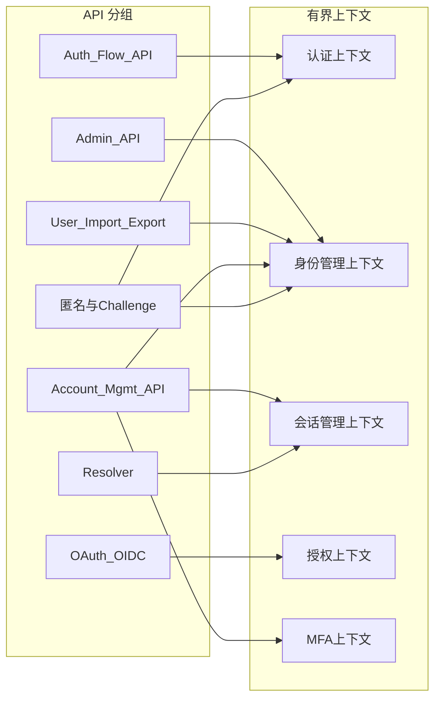

# API 与 DDD 映射

说明各 API 分组对应的有界上下文与聚合，便于从 API 反查领域设计。DDD 详细设计见 [../ddd/README.md](../ddd/README.md)。

## API 分组 → 有界上下文/聚合

| API 分组 | 有界上下文 | 主要聚合 | 说明 |
|----------|------------|----------|------|
| OAuth 2.0 / OIDC | 授权上下文 | — | 元数据、授权码、Token、UserInfo；见 [01-DDD总览.md](../ddd/01-DDD总览.md) 授权上下文 |
| Authentication Flow API | 认证上下文 | AuthenticationFlow | 创建/推进认证流程；见 [认证流程领域设计.md](../ddd/认证流程领域设计.md) |
| Admin API（用户/Events） | 身份管理上下文 | User | 用户 CRUD、GetUsers、Events；见 [领域模型设计.md](../ddd/领域模型设计.md) User 聚合 |
| User Import / Export | 身份管理上下文 | User | 批量用户导入导出，操作 User 聚合 |
| Account Management API | 身份管理上下文、会话管理上下文、MFA 上下文 | User、Session、MFAEnrollment | 身份/认证器/资料/会话管理；见 [Session管理领域设计.md](../ddd/Session管理领域设计.md)、[MFA领域设计.md](../ddd/MFA领域设计.md) |
| Resolver | 会话管理上下文 | IdPSession / OfflineGrant | 解析 Cookie/Token，校验会话；见 [Session管理领域设计.md](../ddd/Session管理领域设计.md) |
| /oauth2/token（refresh） | 授权上下文、会话管理上下文 | OfflineGrant、AccessGrant | 刷新令牌、签发访问令牌 |
| 匿名用户 API、/oauth2/challenge | 认证上下文、身份管理上下文 | User、AuthenticationFlow | 匿名注册、promotion、challenge；见 [认证流程领域设计.md](../ddd/认证流程领域设计.md) |

## 关系概览

## 按有界上下文列举 API

- **认证上下文**：Authentication Flow API、OAuth 授权端点（authorize/consent）、匿名用户与 challenge。
- **身份管理上下文**：Admin API（用户/GetUsers）、User Import/Export、Account Management API（身份与认证器、资料）。
- **会话管理上下文**：Resolver、/oauth2/token（refresh）、Account Management API（会话列表/撤销）。
- **授权上下文**：/.well-known、/oauth2/authorize、/oauth2/token、/oauth2/userinfo、/oauth2/jwks、/oauth2/revoke、/oauth2/end_session。
- **MFA 上下文**：Authentication Flow API 中的 MFA 步骤、Account Management API 中的 TOTP/OOB-OTP/恢复码。

更多聚合与实体定义见 [../ddd/聚合关系图.md](../ddd/聚合关系图.md)。
