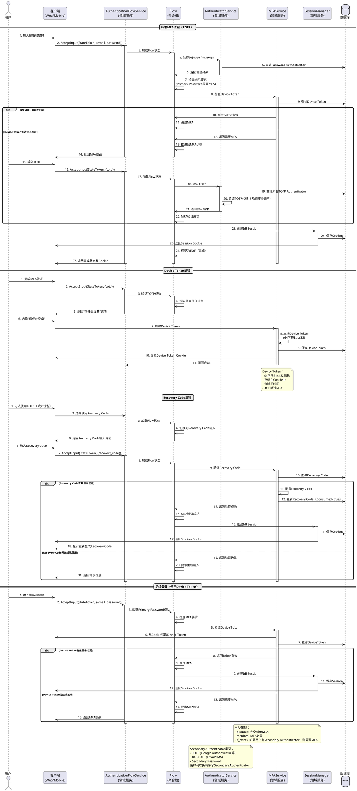

# MFA 流程时序图

```plantuml
@startuml MFA流程时序图
skinparam sequenceMessageAlign center
skinparam roundcorner 10

actor 用户 as User
participant "客户端\n(Web/Mobile)" as Client
participant "AuthenticationFlowService\n(领域服务)" as FlowService
participant "Flow\n(聚合根)" as Flow
participant "AuthenticatorService\n(领域服务)" as AuthService
participant "MFAService\n(领域服务)" as MFAService
participant "SessionManager\n(领域服务)" as SessionManager
database "数据库" as DB

== 标准MFA流程（TOTP） ==

User -> Client: 1. 输入邮箱和密码
Client -> FlowService: 2. AcceptInput(StateToken, {email, password})
activate FlowService
FlowService -> Flow: 3. 加载Flow状态
activate Flow
Flow -> AuthService: 4. 验证Primary Password
activate AuthService
AuthService -> DB: 5. 查询Password Authenticator
AuthService -> Flow: 6. 返回验证结果
deactivate AuthService
Flow -> Flow: 7. 检查MFA要求\n(Primary Password需要MFA)
Flow -> MFAService: 8. 检查Device Token
activate MFAService
MFAService -> DB: 9. 查询Device Token
alt Device Token有效
  MFAService -> Flow: 10. 返回Token有效
  Flow -> Flow: 11. 跳过MFA
else Device Token无效或不存在
  MFAService -> Flow: 12. 返回需要MFA
  Flow -> Flow: 13. 推进到MFA步骤
  FlowService -> Client: 14. 返回MFA挑战
  deactivate FlowService
  deactivate Flow
  
  User -> Client: 15. 输入TOTP
  Client -> FlowService: 16. AcceptInput(StateToken, {totp})
  activate FlowService
  FlowService -> Flow: 17. 加载Flow状态
  activate Flow
  Flow -> AuthService: 18. 验证TOTP
  activate AuthService
  AuthService -> DB: 19. 查询所有TOTP Authenticator
  AuthService -> AuthService: 20. 验证TOTP代码（考虑时钟偏差）
  AuthService -> Flow: 21. 返回验证结果
  deactivate AuthService
  Flow -> Flow: 22. MFA验证成功
end
Flow -> SessionManager: 23. 创建IdPSession
activate SessionManager
SessionManager -> DB: 24. 保存Session
SessionManager -> Client: 25. 返回Session Cookie
deactivate SessionManager
Flow -> Flow: 26. 标记为EOF（完成）
FlowService -> Client: 27. 返回完成状态和Cookie
deactivate FlowService
deactivate Flow
deactivate MFAService

== Device Token流程 ==

User -> Client: 1. 完成MFA验证
Client -> FlowService: 2. AcceptInput(StateToken, {totp})
activate FlowService
FlowService -> Flow: 3. 验证TOTP成功
activate Flow
Flow -> Flow: 4. 询问是否信任设备
FlowService -> Client: 5. 返回"信任此设备"选项
deactivate FlowService
deactivate Flow

User -> Client: 6. 选择"信任此设备"
Client -> MFAService: 7. 创建Device Token
activate MFAService
MFAService -> MFAService: 8. 生成Device Token\n(64字符Base32)
MFAService -> DB: 9. 保存DeviceToken
MFAService -> Client: 10. 设置Device Token Cookie
MFAService -> FlowService: 11. 返回成功
deactivate MFAService

note over MFAService
  Device Token：
  - 64字符Base32编码
  - 存储在Cookie中
  - 有过期时间
  - 用于跳过MFA
end note

== Recovery Code流程 ==

User -> Client: 1. 无法使用TOTP（丢失设备）
Client -> FlowService: 2. 选择使用Recovery Code
FlowService -> Flow: 3. 加载Flow状态
activate Flow
Flow -> Flow: 4. 切换到Recovery Code输入
FlowService -> Client: 5. 返回Recovery Code输入界面
deactivate Flow

User -> Client: 6. 输入Recovery Code
Client -> FlowService: 7. AcceptInput(StateToken, {recovery_code})
activate FlowService
FlowService -> Flow: 8. 加载Flow状态
activate Flow
Flow -> MFAService: 9. 验证Recovery Code
activate MFAService
MFAService -> DB: 10. 查询Recovery Code
alt Recovery Code有效且未使用
  MFAService -> MFAService: 11. 消费Recovery Code
  MFAService -> DB: 12. 更新Recovery Code（Consumed=true）
  MFAService -> Flow: 13. 返回验证成功
  Flow -> Flow: 14. MFA验证成功
  Flow -> SessionManager: 15. 创建IdPSession
  activate SessionManager
  SessionManager -> DB: 16. 保存Session
  SessionManager -> Client: 17. 返回Session Cookie
  deactivate SessionManager
  FlowService -> Client: 18. 提示重新生成Recovery Code
else Recovery Code无效或已使用
  MFAService -> Flow: 19. 返回验证失败
  Flow -> Flow: 20. 要求重新输入
  FlowService -> Client: 21. 返回错误信息
end
deactivate FlowService
deactivate Flow
deactivate MFAService

== 后续登录（使用Device Token） ==

User -> Client: 1. 输入邮箱和密码
Client -> FlowService: 2. AcceptInput(StateToken, {email, password})
activate FlowService
FlowService -> Flow: 3. 验证Primary Password成功
activate Flow
Flow -> Flow: 4. 检查MFA要求
Flow -> MFAService: 5. 验证Device Token
activate MFAService
MFAService -> Client: 6. 从Cookie读取Device Token
MFAService -> DB: 7. 查询DeviceToken
alt Device Token有效且未过期
  MFAService -> Flow: 8. 返回Token有效
  Flow -> Flow: 9. 跳过MFA
  Flow -> SessionManager: 10. 创建IdPSession
  activate SessionManager
  SessionManager -> DB: 11. 保存Session
  SessionManager -> Client: 12. 返回Session Cookie
  deactivate SessionManager
else Device Token无效或过期
  MFAService -> Flow: 13. 返回需要MFA
  Flow -> Flow: 14. 要求MFA验证
  FlowService -> Client: 15. 返回MFA挑战
end
deactivate FlowService
deactivate Flow
deactivate MFAService

note over MFAService
  MFA策略：
  - disabled: 完全禁用MFA
  - required: MFA必需
  - if_exists: 如果用户有Secondary Authenticator，则需要MFA
end note

note over AuthService
  Secondary Authenticator类型：
  - TOTP (Google Authenticator等)
  - OOB-OTP (Email/SMS)
  - Secondary Password
  用户可以拥有多个Secondary Authenticator
end note

@enduml
```

