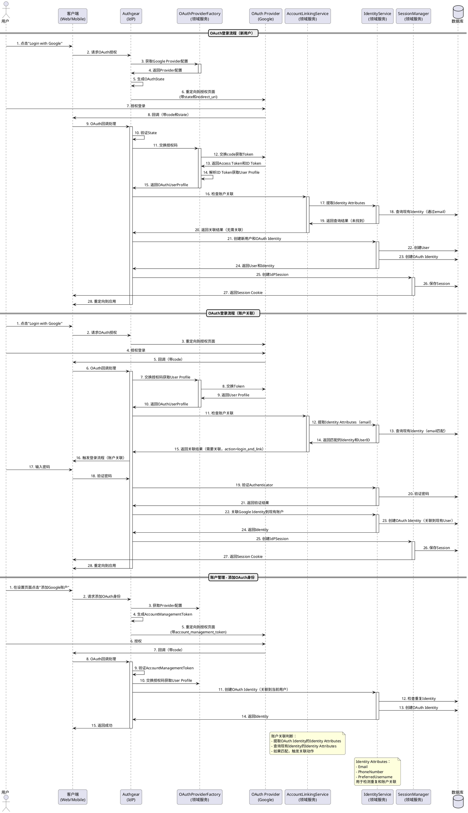

# OAuth 流程时序图

```plantuml
@startuml OAuth流程时序图
skinparam sequenceMessageAlign center
skinparam roundcorner 10

actor 用户 as User
participant "客户端\n(Web/Mobile)" as Client
participant "Authgear\n(IdP)" as Authgear
participant "OAuthProviderFactory\n(领域服务)" as ProviderFactory
participant "OAuth Provider\n(Google)" as Google
participant "AccountLinkingService\n(领域服务)" as LinkingService
participant "IdentityService\n(领域服务)" as IdentityService
participant "SessionManager\n(领域服务)" as SessionManager
database "数据库" as DB

== OAuth登录流程（新用户） ==

User -> Client: 1. 点击"Login with Google"
Client -> Authgear: 2. 请求OAuth授权
Authgear -> ProviderFactory: 3. 获取Google Provider配置
activate ProviderFactory
ProviderFactory -> Authgear: 4. 返回Provider配置
deactivate ProviderFactory
Authgear -> Authgear: 5. 生成OAuthState
Authgear -> Google: 6. 重定向到授权页面\n(带state和redirect_uri)
deactivate Authgear

User -> Google: 7. 授权登录
Google -> Client: 8. 回调（带code和state）
Client -> Authgear: 9. OAuth回调处理
activate Authgear
Authgear -> Authgear: 10. 验证State
Authgear -> ProviderFactory: 11. 交换授权码
activate ProviderFactory
ProviderFactory -> Google: 12. 交换code获取Token
Google -> ProviderFactory: 13. 返回Access Token和ID Token
ProviderFactory -> ProviderFactory: 14. 解析ID Token获取User Profile
ProviderFactory -> Authgear: 15. 返回OAuthUserProfile
deactivate ProviderFactory

Authgear -> LinkingService: 16. 检查账户关联
activate LinkingService
LinkingService -> IdentityService: 17. 提取Identity Attributes
activate IdentityService
IdentityService -> DB: 18. 查询现有Identity（通过email）
IdentityService -> LinkingService: 19. 返回查询结果（未找到）
deactivate IdentityService
LinkingService -> Authgear: 20. 返回关联结果（无需关联）
deactivate LinkingService

Authgear -> IdentityService: 21. 创建新用户和OAuth Identity
activate IdentityService
IdentityService -> DB: 22. 创建User
IdentityService -> DB: 23. 创建OAuth Identity
IdentityService -> Authgear: 24. 返回User和Identity
deactivate IdentityService
Authgear -> SessionManager: 25. 创建IdPSession
activate SessionManager
SessionManager -> DB: 26. 保存Session
SessionManager -> Client: 27. 返回Session Cookie
deactivate SessionManager
Authgear -> Client: 28. 重定向到应用
deactivate Authgear

== OAuth登录流程（账户关联） ==

User -> Client: 1. 点击"Login with Google"
Client -> Authgear: 2. 请求OAuth授权
Authgear -> Google: 3. 重定向到授权页面
User -> Google: 4. 授权登录
Google -> Client: 5. 回调（带code）
Client -> Authgear: 6. OAuth回调处理
activate Authgear
Authgear -> ProviderFactory: 7. 交换授权码获取User Profile
activate ProviderFactory
ProviderFactory -> Google: 8. 交换Token
Google -> ProviderFactory: 9. 返回User Profile
ProviderFactory -> Authgear: 10. 返回OAuthUserProfile
deactivate ProviderFactory

Authgear -> LinkingService: 11. 检查账户关联
activate LinkingService
LinkingService -> IdentityService: 12. 提取Identity Attributes（email）
activate IdentityService
IdentityService -> DB: 13. 查询现有Identity（email匹配）
IdentityService -> LinkingService: 14. 返回匹配的Identity和UserID
deactivate IdentityService
LinkingService -> Authgear: 15. 返回关联结果（需要关联，action=login_and_link）
deactivate LinkingService

Authgear -> Client: 16. 触发登录流程（账户关联）
User -> Client: 17. 输入密码
Client -> Authgear: 18. 验证密码
Authgear -> IdentityService: 19. 验证Authenticator
activate IdentityService
IdentityService -> DB: 20. 验证密码
IdentityService -> Authgear: 21. 返回验证结果
deactivate IdentityService
Authgear -> IdentityService: 22. 关联Google Identity到现有账户
activate IdentityService
IdentityService -> DB: 23. 创建OAuth Identity（关联到现有User）
IdentityService -> Authgear: 24. 返回Identity
deactivate IdentityService
Authgear -> SessionManager: 25. 创建IdPSession
activate SessionManager
SessionManager -> DB: 26. 保存Session
SessionManager -> Client: 27. 返回Session Cookie
deactivate SessionManager
Authgear -> Client: 28. 重定向到应用
deactivate Authgear

== 账户管理 - 添加OAuth身份 ==

User -> Client: 1. 在设置页面点击"添加Google账户"
Client -> Authgear: 2. 请求添加OAuth身份
Authgear -> ProviderFactory: 3. 获取Provider配置
Authgear -> Authgear: 4. 生成AccountManagementToken
Authgear -> Google: 5. 重定向到授权页面\n(带account_management_token)
User -> Google: 6. 授权
Google -> Client: 7. 回调（带code）
Client -> Authgear: 8. OAuth回调处理
activate Authgear
Authgear -> Authgear: 9. 验证AccountManagementToken
Authgear -> ProviderFactory: 10. 交换授权码获取User Profile
Authgear -> IdentityService: 11. 创建OAuth Identity（关联到当前用户）
activate IdentityService
IdentityService -> DB: 12. 检查重复Identity
IdentityService -> DB: 13. 创建OAuth Identity
IdentityService -> Authgear: 14. 返回Identity
deactivate IdentityService
Authgear -> Client: 15. 返回成功
deactivate Authgear

note over LinkingService
  账户关联判断：
  - 提取OAuth Identity的Identity Attributes
  - 查询现有Identity的Identity Attributes
  - 如果匹配，触发关联动作
end note

note over IdentityService
  Identity Attributes：
  - Email
  - PhoneNumber
  - PreferredUsername
  用于检测重复和账户关联
end note

@enduml
```
