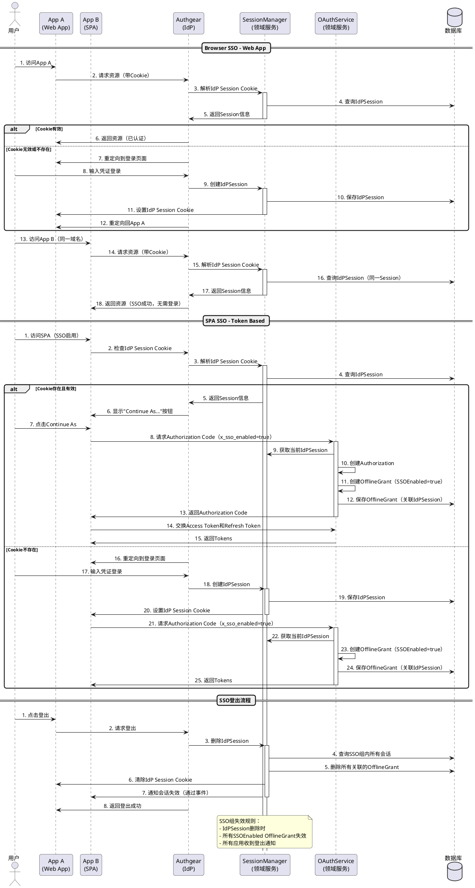

# SSO 流程时序图

```plantuml
@startuml SSO流程时序图
skinparam sequenceMessageAlign center
skinparam roundcorner 10

actor 用户 as User
participant "App A\n(Web App)" as AppA
participant "App B\n(SPA)" as AppB
participant "Authgear\n(IdP)" as Authgear
participant "SessionManager\n(领域服务)" as SessionManager
participant "OAuthService\n(领域服务)" as OAuthService
database "数据库" as DB

== Browser SSO - Web App ==

User -> AppA: 1. 访问App A
AppA -> Authgear: 2. 请求资源（带Cookie）
Authgear -> SessionManager: 3. 解析IdP Session Cookie
activate SessionManager
SessionManager -> DB: 4. 查询IdPSession
SessionManager -> Authgear: 5. 返回Session信息
deactivate SessionManager
alt Cookie有效
  Authgear -> AppA: 6. 返回资源（已认证）
else Cookie无效或不存在
  Authgear -> AppA: 7. 重定向到登录页面
  User -> Authgear: 8. 输入凭证登录
  Authgear -> SessionManager: 9. 创建IdPSession
  activate SessionManager
  SessionManager -> DB: 10. 保存IdPSession
  SessionManager -> AppA: 11. 设置IdP Session Cookie
  deactivate SessionManager
  Authgear -> AppA: 12. 重定向回App A
end

User -> AppB: 13. 访问App B（同一域名）
AppB -> Authgear: 14. 请求资源（带Cookie）
Authgear -> SessionManager: 15. 解析IdP Session Cookie
activate SessionManager
SessionManager -> DB: 16. 查询IdPSession（同一Session）
SessionManager -> Authgear: 17. 返回Session信息
deactivate SessionManager
Authgear -> AppB: 18. 返回资源（SSO成功，无需登录）

== SPA SSO - Token Based ==

User -> AppB: 1. 访问SPA（SSO启用）
AppB -> Authgear: 2. 检查IdP Session Cookie
Authgear -> SessionManager: 3. 解析IdP Session Cookie
activate SessionManager
SessionManager -> DB: 4. 查询IdPSession
alt Cookie存在且有效
  SessionManager -> Authgear: 5. 返回Session信息
  Authgear -> AppB: 6. 显示"Continue As..."按钮
  User -> AppB: 7. 点击Continue As
  AppB -> OAuthService: 8. 请求Authorization Code（x_sso_enabled=true）
  activate OAuthService
  OAuthService -> SessionManager: 9. 获取当前IdPSession
  OAuthService -> OAuthService: 10. 创建Authorization
  OAuthService -> OAuthService: 11. 创建OfflineGrant（SSOEnabled=true）
  OAuthService -> DB: 12. 保存OfflineGrant（关联IdPSession）
  OAuthService -> AppB: 13. 返回Authorization Code
  deactivate OAuthService
  AppB -> OAuthService: 14. 交换Access Token和Refresh Token
  OAuthService -> AppB: 15. 返回Tokens
else Cookie不存在
  Authgear -> AppB: 16. 重定向到登录页面
  User -> Authgear: 17. 输入凭证登录
  Authgear -> SessionManager: 18. 创建IdPSession
  activate SessionManager
  SessionManager -> DB: 19. 保存IdPSession
  SessionManager -> AppB: 20. 设置IdP Session Cookie
  deactivate SessionManager
  AppB -> OAuthService: 21. 请求Authorization Code（x_sso_enabled=true）
  activate OAuthService
  OAuthService -> SessionManager: 22. 获取当前IdPSession
  OAuthService -> OAuthService: 23. 创建OfflineGrant（SSOEnabled=true）
  OAuthService -> DB: 24. 保存OfflineGrant（关联IdPSession）
  OAuthService -> AppB: 25. 返回Tokens
  deactivate OAuthService
end

== SSO登出流程 ==

User -> AppA: 1. 点击登出
AppA -> Authgear: 2. 请求登出
Authgear -> SessionManager: 3. 删除IdPSession
activate SessionManager
SessionManager -> DB: 4. 查询SSO组内所有会话
SessionManager -> DB: 5. 删除所有关联的OfflineGrant
SessionManager -> AppA: 6. 清除IdP Session Cookie
SessionManager -> AppB: 7. 通知会话失效（通过事件）
deactivate SessionManager
Authgear -> AppA: 8. 返回登出成功

note over SessionManager
  SSO组失效规则：
  - IdPSession删除时
  - 所有SSOEnabled OfflineGrant失效
  - 所有应用收到登出通知
end note

@enduml
```
