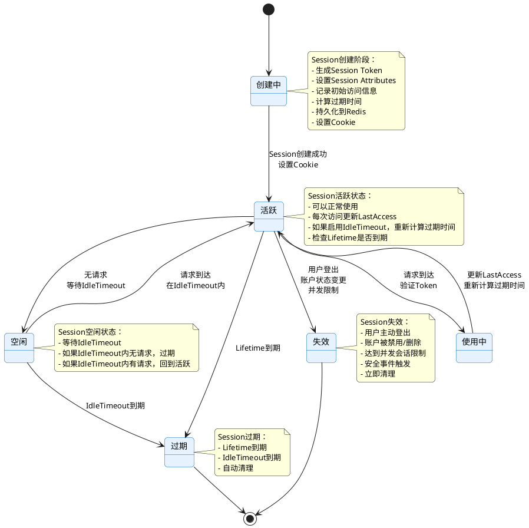

# Session 生命周期图

```plantuml
@startuml Session生命周期图
skinparam roundcorner 10
skinparam state {
  BackgroundColor #E6F3FF
  BorderColor #0066CC
}

[*] --> 创建中

创建中 --> 活跃 : Session创建成功\n设置Cookie

活跃 --> 使用中 : 请求到达\n验证Token

使用中 --> 活跃 : 更新LastAccess\n重新计算过期时间

活跃 --> 空闲 : 无请求\n等待IdleTimeout

空闲 --> 活跃 : 请求到达\n在IdleTimeout内

空闲 --> 过期 : IdleTimeout到期

活跃 --> 过期 : Lifetime到期

活跃 --> 失效 : 用户登出\n账户状态变更\n并发限制

过期 --> [*]

失效 --> [*]

note right of 创建中
  Session创建阶段：
  - 生成Session Token
  - 设置Session Attributes
  - 记录初始访问信息
  - 计算过期时间
  - 持久化到Redis
  - 设置Cookie
end note

note right of 活跃
  Session活跃状态：
  - 可以正常使用
  - 每次访问更新LastAccess
  - 如果启用IdleTimeout，重新计算过期时间
  - 检查Lifetime是否到期
end note

note right of 空闲
  Session空闲状态：
  - 等待IdleTimeout
  - 如果IdleTimeout内无请求，过期
  - 如果IdleTimeout内有请求，回到活跃
end note

note right of 过期
  Session过期：
  - Lifetime到期
  - IdleTimeout到期
  - 自动清理
end note

note right of 失效
  Session失效：
  - 用户主动登出
  - 账户被禁用/删除
  - 达到并发会话限制
  - 安全事件触发
  - 立即清理
end note

@enduml
```
