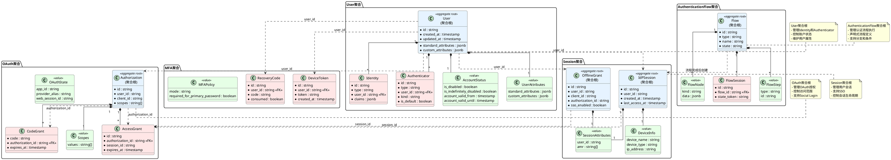

# 聚合关系图

```plantuml
@startuml 聚合关系图
skinparam linetype ortho
skinparam roundcorner 10

package "User聚合" {
  class "User\n(聚合根)" as User <<aggregate root>> #E6F3FF {
    * id : string
    * created_at : timestamp
    * updated_at : timestamp
    --
    * standard_attributes : jsonb
    * custom_attributes : jsonb
  }
  
  class "Identity" as Identity #FFE6E6 {
    * id : string
    * type : string
    * user_id : string <<FK>>
    * claims : jsonb
  }
  
  class "Authenticator" as Authenticator #FFE6E6 {
    * id : string
    * type : string
    * user_id : string <<FK>>
    * kind : string
    * is_default : boolean
  }
  
  class "AccountStatus" as AccountStatus <<value>> #E6FFE6 {
    is_disabled : boolean
    is_indefinitely_disabled : boolean
    account_valid_from : timestamp
    account_valid_until : timestamp
  }
  
  class "UserAttributes" as UserAttributes <<value>> #E6FFE6 {
    standard_attributes : jsonb
    custom_attributes : jsonb
  }
  
  User "1" *-- "*" Identity
  User "1" *-- "*" Authenticator
  User "1" *-- "1" AccountStatus
  User "1" *-- "1" UserAttributes
}

package "Session聚合" {
  class "IdPSession\n(聚合根)" as IdPSession <<aggregate root>> #E6F3FF {
    * id : string
    * user_id : string
    * created_at : timestamp
    * last_access_at : timestamp
  }
  
  class "OfflineGrant\n(聚合根)" as OfflineGrant <<aggregate root>> #E6F3FF {
    * id : string
    * user_id : string
    * client_id : string
    * authorization_id : string
    * sso_enabled : boolean
  }
  
  class "SessionAttributes" as SessionAttributes <<value>> #E6FFE6 {
    user_id : string
    amr : string[]
  }
  
  class "DeviceInfo" as DeviceInfo <<value>> #E6FFE6 {
    device_name : string
    device_type : string
    ip_address : string
  }
  
  IdPSession "1" *-- "1" SessionAttributes
  IdPSession "1" *-- "1" DeviceInfo
  OfflineGrant "1" *-- "1" SessionAttributes
}

package "AuthenticationFlow聚合" {
  class "Flow\n(聚合根)" as Flow <<aggregate root>> #E6F3FF {
    * id : string
    * type : string
    * name : string
    * state : string
  }
  
  class "FlowSession" as FlowSession #FFE6E6 {
    * id : string
    * flow_id : string <<FK>>
    * state_token : string
  }
  
  class "FlowStep" as FlowStep <<value>> #E6FFE6 {
    type : string
    id : string
  }
  
  class "FlowNode" as FlowNode <<value>> #E6FFE6 {
    kind : string
    data : jsonb
  }
  
  Flow "1" *-- "*" FlowSession
  Flow "1" *-- "*" FlowStep
  Flow "1" *-- "*" FlowNode
}

package "OAuth聚合" {
  class "Authorization\n(聚合根)" as Authorization <<aggregate root>> #E6F3FF {
    * id : string
    * user_id : string
    * client_id : string
    * scopes : string[]
  }
  
  class "AccessGrant" as AccessGrant #FFE6E6 {
    * id : string
    * authorization_id : string <<FK>>
    * session_id : string
    * expires_at : timestamp
  }
  
  class "CodeGrant" as CodeGrant #FFE6E6 {
    * code : string
    * authorization_id : string <<FK>>
    * expires_at : timestamp
  }
  
  class "OAuthState" as OAuthState <<value>> #E6FFE6 {
    app_id : string
    provider_alias : string
    web_session_id : string
  }
  
  class "Scopes" as Scopes <<value>> #E6FFE6 {
    values : string[]
  }
  
  Authorization "1" *-- "*" AccessGrant
  Authorization "1" *-- "*" CodeGrant
  Authorization "1" *-- "1" Scopes
}

package "MFA聚合" {
  class "DeviceToken" as DeviceToken #FFE6E6 {
    * id : string
    * user_id : string <<FK>>
    * token : string
    * created_at : timestamp
  }
  
  class "RecoveryCode" as RecoveryCode #FFE6E6 {
    * id : string
    * user_id : string <<FK>>
    * code : string
    * consumed : boolean
  }
  
  class "MFAPolicy" as MFAPolicy <<value>> #E6FFE6 {
    mode : string
    required_for_primary_password : boolean
  }
}

User ..> IdPSession : user_id
User ..> OfflineGrant : user_id
User ..> Authorization : user_id
User ..> DeviceToken : user_id
User ..> RecoveryCode : user_id

IdPSession ..> AccessGrant : session_id
OfflineGrant ..> AccessGrant : session_id

Authorization ..> AccessGrant : authorization_id
Authorization ..> CodeGrant : authorization_id

Flow ..> IdPSession : 流程完成后创建

note right of User
  User聚合根
  - 管理Identity和Authenticator
  - 控制账户状态
  - 维护用户属性
end note

note right of IdPSession
  Session聚合根
  - 管理用户会话
  - 支持SSO
  - 控制会话生命周期
end note

note right of Flow
  AuthenticationFlow聚合根
  - 管理认证流程执行
  - 声明式流程定义
  - 支持分支和条件
end note

note right of Authorization
  OAuth聚合根
  - 管理OAuth授权
  - 控制访问范围
  - 支持Social Login
end note

@enduml
```
