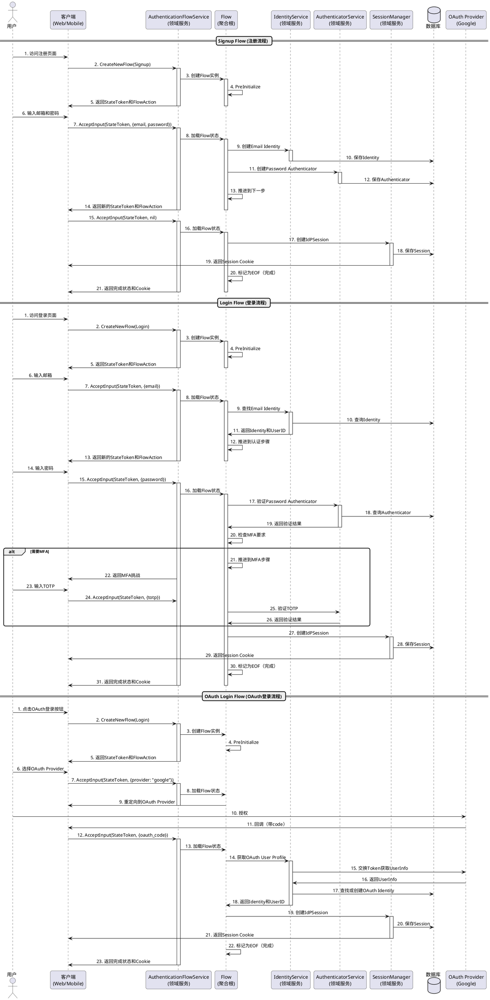

# 认证流程时序图

```plantuml
@startuml 认证流程时序图
skinparam sequenceMessageAlign center
skinparam roundcorner 10

actor 用户 as User
participant "客户端\n(Web/Mobile)" as Client
participant "AuthenticationFlowService\n(领域服务)" as FlowService
participant "Flow\n(聚合根)" as Flow
participant "IdentityService\n(领域服务)" as IdentityService
participant "AuthenticatorService\n(领域服务)" as IdentityService2
participant "SessionManager\n(领域服务)" as SessionManager
database "数据库" as DB

== Signup Flow (注册流程) ==

User -> Client: 1. 访问注册页面
Client -> FlowService: 2. CreateNewFlow(Signup)
activate FlowService
FlowService -> Flow: 3. 创建Flow实例
activate Flow
Flow -> Flow: 4. PreInitialize
FlowService -> Client: 5. 返回StateToken和FlowAction
deactivate FlowService
deactivate Flow

User -> Client: 6. 输入邮箱和密码
Client -> FlowService: 7. AcceptInput(StateToken, {email, password})
activate FlowService
FlowService -> Flow: 8. 加载Flow状态
activate Flow
Flow -> IdentityService: 9. 创建Email Identity
activate IdentityService
IdentityService -> DB: 10. 保存Identity
deactivate IdentityService
Flow -> IdentityService2: 11. 创建Password Authenticator
activate IdentityService2
IdentityService2 -> DB: 12. 保存Authenticator
deactivate IdentityService2
Flow -> Flow: 13. 推进到下一步
FlowService -> Client: 14. 返回新的StateToken和FlowAction
deactivate FlowService
deactivate Flow

Client -> FlowService: 15. AcceptInput(StateToken, nil)
activate FlowService
FlowService -> Flow: 16. 加载Flow状态
activate Flow
Flow -> SessionManager: 17. 创建IdPSession
activate SessionManager
SessionManager -> DB: 18. 保存Session
SessionManager -> Client: 19. 返回Session Cookie
deactivate SessionManager
Flow -> Flow: 20. 标记为EOF（完成）
FlowService -> Client: 21. 返回完成状态和Cookie
deactivate FlowService
deactivate Flow

== Login Flow (登录流程) ==

User -> Client: 1. 访问登录页面
Client -> FlowService: 2. CreateNewFlow(Login)
activate FlowService
FlowService -> Flow: 3. 创建Flow实例
activate Flow
Flow -> Flow: 4. PreInitialize
FlowService -> Client: 5. 返回StateToken和FlowAction
deactivate FlowService
deactivate Flow

User -> Client: 6. 输入邮箱
Client -> FlowService: 7. AcceptInput(StateToken, {email})
activate FlowService
FlowService -> Flow: 8. 加载Flow状态
activate Flow
Flow -> IdentityService: 9. 查找Email Identity
activate IdentityService
IdentityService -> DB: 10. 查询Identity
IdentityService -> Flow: 11. 返回Identity和UserID
deactivate IdentityService
Flow -> Flow: 12. 推进到认证步骤
FlowService -> Client: 13. 返回新的StateToken和FlowAction
deactivate FlowService
deactivate Flow

User -> Client: 14. 输入密码
Client -> FlowService: 15. AcceptInput(StateToken, {password})
activate FlowService
FlowService -> Flow: 16. 加载Flow状态
activate Flow
Flow -> IdentityService2: 17. 验证Password Authenticator
activate IdentityService2
IdentityService2 -> DB: 18. 查询Authenticator
IdentityService2 -> Flow: 19. 返回验证结果
deactivate IdentityService2
Flow -> Flow: 20. 检查MFA要求
alt 需要MFA
  Flow -> Flow: 21. 推进到MFA步骤
  FlowService -> Client: 22. 返回MFA挑战
  User -> Client: 23. 输入TOTP
  Client -> FlowService: 24. AcceptInput(StateToken, {totp})
  Flow -> IdentityService2: 25. 验证TOTP
  IdentityService2 -> Flow: 26. 返回验证结果
end
Flow -> SessionManager: 27. 创建IdPSession
activate SessionManager
SessionManager -> DB: 28. 保存Session
SessionManager -> Client: 29. 返回Session Cookie
deactivate SessionManager
Flow -> Flow: 30. 标记为EOF（完成）
FlowService -> Client: 31. 返回完成状态和Cookie
deactivate FlowService
deactivate Flow

== OAuth Login Flow (OAuth登录流程) ==

User -> Client: 1. 点击OAuth登录按钮
Client -> FlowService: 2. CreateNewFlow(Login)
activate FlowService
FlowService -> Flow: 3. 创建Flow实例
Flow -> Flow: 4. PreInitialize
FlowService -> Client: 5. 返回StateToken和FlowAction
deactivate FlowService

User -> Client: 6. 选择OAuth Provider
Client -> FlowService: 7. AcceptInput(StateToken, {provider: "google"})
activate FlowService
FlowService -> Flow: 8. 加载Flow状态
Flow -> Client: 9. 重定向到OAuth Provider
deactivate FlowService

User -> "OAuth Provider\n(Google)" as OAuthProvider: 10. 授权
OAuthProvider -> Client: 11. 回调（带code）
Client -> FlowService: 12. AcceptInput(StateToken, {oauth_code})
activate FlowService
FlowService -> Flow: 13. 加载Flow状态
Flow -> IdentityService: 14. 获取OAuth User Profile
activate IdentityService
IdentityService -> OAuthProvider: 15. 交换Token获取UserInfo
OAuthProvider -> IdentityService: 16. 返回UserInfo
IdentityService -> DB: 17. 查找或创建OAuth Identity
IdentityService -> Flow: 18. 返回Identity和UserID
deactivate IdentityService
Flow -> SessionManager: 19. 创建IdPSession
activate SessionManager
SessionManager -> DB: 20. 保存Session
SessionManager -> Client: 21. 返回Session Cookie
deactivate SessionManager
Flow -> Flow: 22. 标记为EOF（完成）
FlowService -> Client: 23. 返回完成状态和Cookie
deactivate FlowService

@enduml
```
