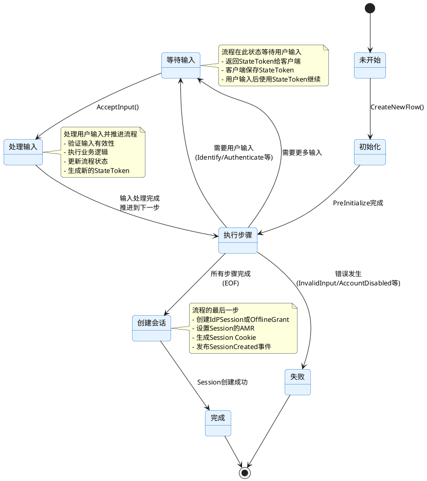

# 认证流程状态机

```plantuml
@startuml 认证流程状态机
skinparam roundcorner 10
skinparam state {
  BackgroundColor #E6F3FF
  BorderColor #0066CC
}

[*] --> 未开始

未开始 --> 初始化 : CreateNewFlow()

初始化 --> 执行步骤 : PreInitialize完成

执行步骤 --> 等待输入 : 需要用户输入\n(Identify/Authenticate等)

等待输入 --> 处理输入 : AcceptInput()

处理输入 --> 执行步骤 : 输入处理完成\n推进到下一步

执行步骤 --> 等待输入 : 需要更多输入

执行步骤 --> 创建会话 : 所有步骤完成\n(EOF)

创建会话 --> 完成 : Session创建成功

完成 --> [*]

执行步骤 --> 失败 : 错误发生\n(InvalidInput/AccountDisabled等)

失败 --> [*]

note right of 等待输入
  流程在此状态等待用户输入
  - 返回StateToken给客户端
  - 客户端保存StateToken
  - 用户输入后使用StateToken继续
end note

note right of 处理输入
  处理用户输入并推进流程
  - 验证输入有效性
  - 执行业务逻辑
  - 更新流程状态
  - 生成新的StateToken
end note

note right of 创建会话
  流程的最后一步
  - 创建IdPSession或OfflineGrant
  - 设置Session的AMR
  - 生成Session Cookie
  - 发布SessionCreated事件
end note

@enduml
```
