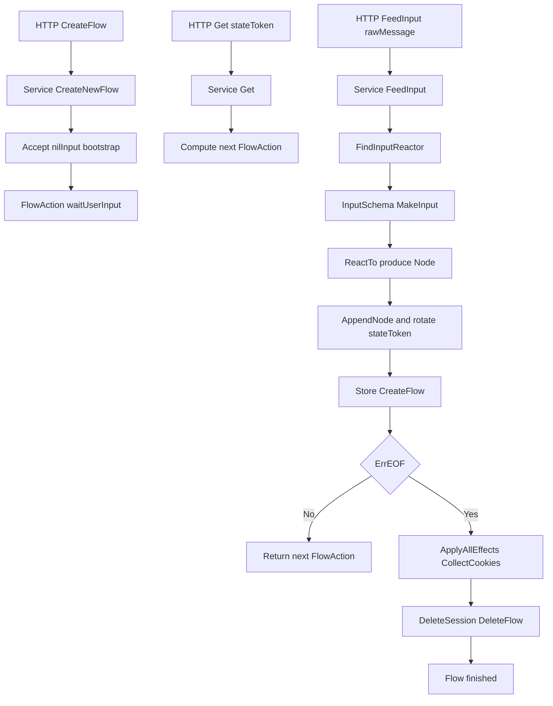

# Authentication Flow 代码实现分析

## 接口与入口

`AuthenticationFlowV1WorkflowService` 定义在 `pkg/auth/handler/api/authenticationflow_v1.go`：

- `CreateNewFlow(ctx, intent, sessionOptions)`
- `Get(ctx, stateToken)`
- `FeedInput(ctx, stateToken, rawMessage)`

实际实现是 `pkg/lib/authenticationflow/service.go` 的 `Service`，通过依赖注入绑定给 API/Web handler。

HTTP 入口：

- 创建 flow：`/api/v1/authentication_flows`
- 查询 flow：`/api/v1/authentication_flows/states`
- 投喂输入：`/api/v1/authentication_flows/states/input`

关键接口代码：

```go
type AuthenticationFlowV1WorkflowService interface {
	CreateNewFlow(ctx context.Context, intent authflow.PublicFlow, sessionOptions *authflow.SessionOptions) (*authflow.ServiceOutput, error)
	Get(ctx context.Context, stateToken string) (*authflow.ServiceOutput, error)
	FeedInput(ctx context.Context, stateToken string, rawMessage json.RawMessage) (*authflow.ServiceOutput, error)
}
```

---

## 生命周期（从 HTTP 到 finished）

### 1) CreateNewFlow

在 `Service.CreateNewFlow` 中：

1. `validateNewFlow` 校验 flow 是否允许创建。
2. 创建 `Session`（绑定 `flow_id`）并持久化。
3. 调用 `createNewFlow`：
   - 创建 `Flow`（`NewFlow`）。
   - 调用 `Accept(..., rawMessage=nil)` 进行“无输入预推进”，直到到达可交互步骤。
   - 计算当前 `FlowAction`。
   - 把 flow 快照写入 Store（Redis）。
4. 若初始化阶段直接 `ErrEOF`，走完成逻辑：
   - `finishFlow`（`ApplyAllEffects` + `CollectCookies`）
   - 删除 `Session` 与 `Flow`
   - 返回完成态（`ErrEOF`）

关键代码片段：

```go
func (s *Service) CreateNewFlow(ctx context.Context, publicFlow PublicFlow, sessionOptions *SessionOptions) (output *ServiceOutput, err error) {
	err = s.validateNewFlow(publicFlow, sessionOptions)
	if err != nil {
		return
	}

	session := NewSession(sessionOptions)
	ctx = session.MakeContext(ctx, s.Deps)

	err = s.Store.CreateSession(ctx, session)
	if err != nil {
		return
	}
	return s.createNewFlowWithSession(ctx, publicFlow, session)
}
```

### 2) Get

`Service.Get`：

1. 用 `stateToken` 读取 flow。
2. 读取 session 并把 session context 注入上下文。
3. 在只读事务中：
   - `ApplyRunEffects`
   - `getFlowAction` 计算下一步动作
4. 返回当前状态与 action（不推进流程节点，不重写 flow）。

关键代码片段：

```go
func (s *Service) Get(ctx context.Context, stateToken string) (output *ServiceOutput, err error) {
	w, err := s.Store.GetFlowByStateToken(ctx, stateToken)
	if err != nil {
		return
	}
	ctx, session, err := s.getSessionAndUpdateContext(ctx, w.FlowID)
	if err != nil {
		return
	}
	err = s.Database.ReadOnly(ctx, func(ctx context.Context) error {
		output, err = s.get(ctx, session, w)
		return err
	})
	return
}
```

### 3) FeedInput

`Service.FeedInput`：

1. 正常路径：用 `stateToken` 取 flow；特殊路径（如找回码）可先从输入推导出 `stateToken`。
2. 读取 session 并更新 context。
3. 调用 `feedInput` 推进：
   - `ApplyRunEffects`
   - `Accept` 消费本次输入
   - `getFlowAction` 得到下一动作
   - `processAcceptResult` 处理延迟函数、bot verification 等
   - 若 flow 有变化，会生成新 `stateToken`
4. 把更新后的 flow 快照写回 Store。
5. 若出现 `ErrSwitchFlow`/`ErrRewriteFlow`，走切流/重写逻辑（可能再喂 synthetic input）。
6. 若 `ErrEOF`，执行 finish 收尾并删除 session/flow。

关键代码片段：

```go
func (s *Service) FeedInput(ctx context.Context, stateToken string, rawMessage json.RawMessage) (output *ServiceOutput, err error) {
	flow, err := s.Store.GetFlowByStateToken(ctx, stateToken)
	if err != nil {
		return
	}
	ctx, session, err := s.getSessionAndUpdateContext(ctx, flow.FlowID)
	if err != nil {
		return
	}
	var flowAction *FlowAction
	flow, flowAction, err = s.feedInput(ctx, session, stateToken, rawMessage)
	isEOF := errors.Is(err, ErrEOF)
	if err != nil && !isEOF {
		return
	}
	// ... assemble output; EOF 时 finishFlow + DeleteSession + DeleteFlow
	_ = flowAction
	return
}
```

### 4) finished 判定

finished 不是靠单独布尔字段驱动，而是流程推进时无可响应输入对象，返回 `ErrEOF`：

- `getFlowAction` 会把此状态映射为 `FlowActionTypeFinished`
- 结束时执行提交期 effect、收集 cookie、清理 flow/session

finished 映射代码：

```go
func (s *Service) getFlowAction(ctx context.Context, session *Session, flow *Flow) (flowAction *FlowAction, err error) {
	findInputReactorResult, err := FindInputReactor(ctx, s.Deps, NewFlows(flow))
	if errors.Is(err, ErrEOF) {
		flowAction = &FlowAction{
			Type: FlowActionTypeFinished,
			Data: data,
		}
		return
	}
	_ = findInputReactorResult
	return
}
```

---

## workflow 设计范式：是不是状态机？

结论：**不是传统“状态枚举 + 转移表”的 FSM 实现**，而是 **Reactor 驱动的 workflow graph**。

核心特征：

1. `Flow = Intent + Nodes[]`，每次输入后追加 `Node`。
2. 当前输入由 `FindInputReactor` 动态决策：
   - 优先最近可响应的节点
   - 否则回退到 flow 的 `Intent`
3. 支持 `NodeTypeSubFlow`，可形成嵌套子流程图。
4. 持久化是“当前 flow 快照”（Redis JSON），不是事件溯源日志。

动态路由与推进代码：

```go
func FindInputReactorForFlow(ctx context.Context, deps *Dependencies, flows Flows) (*FindInputReactorResult, error) {
	if len(flows.Nearest.Nodes) > 0 {
		lastNode := flows.Nearest.Nodes[len(flows.Nearest.Nodes)-1]
		findInputReactorResult, err := FindInputReactorForNode(ctx, deps, flows, &lastNode)
		if err == nil {
			return findInputReactorResult, nil
		}
		if !errors.Is(err, ErrEOF) {
			return nil, err
		}
	}
	inputSchema, err := flows.Nearest.Intent.CanReactTo(ctx, deps, flows)
	if err == nil {
		return &FindInputReactorResult{
			Flows:        flows,
			InputReactor: flows.Nearest.Intent,
			InputSchema:  inputSchema,
		}, nil
	}
	return nil, err
}
```

```go
func doAccept(ctx context.Context, deps *Dependencies, flows Flows, result *AcceptResult, inputFn func(inputSchema InputSchema) (Input, error)) (err error) {
	var changed bool
	defer func() {
		if changed {
			flows.Nearest.StateToken = newStateToken()
		}
		if !changed && err == nil {
			err = ErrNoChange
		}
	}()
	// ... loop FindInputReactor + ReactTo + appendNode
	return
}
```

---

## 关键对象职责

- `Intent`：流程根级“可响应对象”（可判断/消费输入）
- `Node`：一步执行结果；可为简单节点或子 flow 节点
- `Flows`：维护 `Root` 与当前 `Nearest`（用于嵌套 flow）
- `InputSchema`：把 `rawMessage` 校验并解析为 typed input
- `InputReactor`：`CanReactTo` + `ReactTo`
- `FlowAction`：返回给前端的下一步动作（包含 finished）

Flow 结构代码：

```go
type Flow struct {
	FlowID     string
	StateToken string
	Intent     Intent
	Nodes      []Node
}
```

---

## 状态与持久化

在 `store.go` 中：

- `state_token` 对应 flow 快照 key（JSON）
- `flow_id` 对应“活跃 flow”key（用于有效性判断）
- `session` 按 `flow_id` 存储
- 生命周期 TTL 使用 `duration.UserInteraction`

`DeleteFlow` 主要删 `flow_id` key；历史 state key 可以存在，但因为活跃 key 消失而被判定不可用。

Store 关键代码：

```go
func (s *StoreImpl) CreateFlow(ctx context.Context, flow *Flow) error {
	bytes, err := json.Marshal(flow)
	if err != nil {
		return err
	}
	return s.Redis.WithConnContext(ctx, func(ctx context.Context, conn redis.Redis_6_0_Cmdable) error {
		flowKey := redisFlowKey(s.AppID, flow.FlowID)
		stateKey := redisFlowStateKey(s.AppID, flow.StateToken)
		ttl := Lifetime
		_, err := conn.SetEx(ctx, flowKey, []byte(flowKey), ttl).Result()
		if err != nil {
			return err
		}
		_, err = conn.SetEx(ctx, stateKey, bytes, ttl).Result()
		return err
	})
}
```

---

## 简化时序图



---

## 一句话总结

`AuthenticationFlowV1WorkflowService` 的实现是“**可反应对象 + 节点追加 + 动态输入路由**”的工作流引擎：`CreateNewFlow` 负责建会话与预推进，`Get` 负责读状态，`FeedInput` 负责推进；完成信号由 `ErrEOF` 与 `FlowActionTypeFinished` 共同表达。
