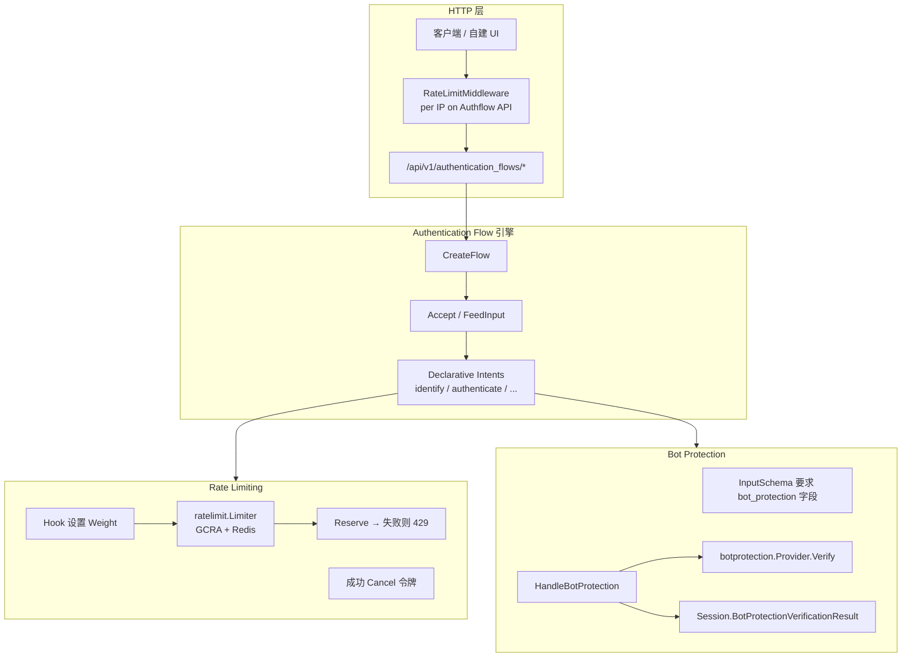
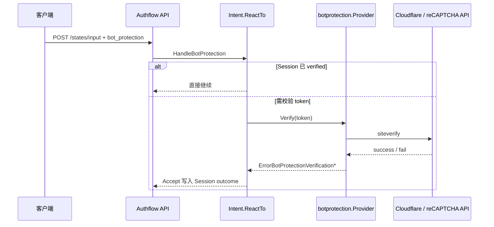

# Authgear Authentication Flow：Bot Protection 与 Rate Limiting 深度调研

## 目录

1. [概述](#1-概述)
2. [整体架构](#2-整体架构)
3. [Rate Limiting 实现](#3-rate-limiting-实现)
4. [Bot Protection 实现](#4-bot-protection-实现)
5. [Authentication Flow API（HTTP 调用）](#5-authentication-flow-apihttp-调用)
6. [配置参考](#6-配置参考)
7. [与官方 Spec 的差异说明](#7-与官方-spec-的差异说明)
8. [核心代码索引](#8-核心代码索引)

---

## 1. 概述

Authgear 在 **Authentication Flow**（声明式登录/注册/找回账号等流程）中，通过两套机制抵御滥用：


| 机制                 | 目的                                                     | 主要包                                                                |
| ------------------ | ------------------------------------------------------ | ------------------------------------------------------------------ |
| **Rate Limiting**  | 限制请求频率、暴力破解、短信/邮件轰炸、账号枚举                               | `pkg/lib/ratelimit`                                                |
| **Bot Protection** | 人机验证（Challenge），在敏感步骤要求 Turnstile / reCAPTCHA v2 token | `pkg/lib/botprotection` + `pkg/lib/authenticationflow/declarative` |


两者关系：

- **Rate limiting** 在 HTTP 层（Authflow API 全局限流）与各业务步骤（密码校验、OTP 发送/校验、注册提交等）多层叠加。
- **Bot protection** 在需要保护的 **Intent/Node** 收到用户 input 时校验 token；通过后结果写入 **Session**，同一会话后续步骤可 **bypass** 重复挑战。
- **Blocking Hook**（`authentication.pre_initialize` / `post_identified` / `pre_authenticate`）可动态调整限流 **权重**，也可通过 hook 响应影响 bot protection 要求（`bot_protection_requirements`）。

官方规格：

- [docs/specs/rate-limit.md](https://github.com/authgear/authgear-server/blob/main/docs/specs/rate-limit.md)
- [docs/specs/bot-protection.md](https://github.com/authgear/authgear-server/blob/main/docs/specs/bot-protection.md)
- [docs/specs/authentication-flow-api-reference.md](https://github.com/authgear/authgear-server/blob/main/docs/specs/authentication-flow-api-reference.md)

本仓库学习笔记（限流专题）：[Authgear-Rate-Limit机制说明.md](./Authgear-Rate-Limit机制说明.md)

---

## 2. 整体架构




**请求路径摘要：**

1. 所有 Authflow API 请求先经过 `authenticationFlowChain` 中的 `RateLimitMiddleware`（默认每 IP 1200 次/分钟，见 `authentication_flow.rate_limits.per_ip`）。
2. `POST .../states/input` 驱动 `FeedInput` → `Accept` 循环执行 Intent。
3. 各 Intent 在 `ReactTo` 中按需调用 `HandleBotProtection` 与 `deps.RateLimiter` / `deps.Authenticators`（内部再限流）。

---

## 3. Rate Limiting 实现

### 3.1 核心算法与存储

实现位于 `pkg/lib/ratelimit`：

- **算法**：GCRA（Generic Cell Rate Algorithm）变体，Redis Lua 脚本原子更新（`gcra.go`）。
- **参数**：`period`（周期）、`burst`（桶容量）；首次取令牌后，经过 `period` 整桶 refill。
- **存储键**：
  - 租户级：`app:{appID}:rate-limit:{bucketName}:{args...}`
  - 全局级：`rate-limit:{bucketName}:{args...}`（如全局 SMS/Email）

```68:147:pkg/lib/ratelimit/limiter.go
func (l *Limiter) doReserveN(ctx context.Context, spec BucketSpec, n float64) (*Reservation, *FailedReservation, *time.Time, error) {
	// ...
	if l.Config.Disabled || !spec.Enabled {
		return &Reservation{ /* 空 reservation，不消耗 */ }, nil, nil, nil
	}
	ok, timeToAct, err := l.Storage.Update(ctx, key, spec.Period, spec.Burst, n)
	// ...
	if ok {
		return &Reservation{ /* ... */ }, nil, &timeToAct, nil
	}
	// 超限 → FailedReservation + 可选 audit event rate_limit.blocked
	return nil, &FailedReservation{ /* ... */ }, &timeToAct, nil
}
```

**权重（Weight）**：`Reserve` 时 `n = spec.RateLimitGroup.ResolveWeight(ctx)`，默认 `1`。Hook 可通过 `ratelimit.SetRateLimitWeights` 将某 group 权重设为 `0`（等效关闭）或更大值（更快耗尽配额）。

### 3.2 「失败才扣令牌」模式

对 **凭证校验**（密码、OTP 校验等），模式为：

1. 操作前先 `Reserve`（检查桶里是否有可用令牌）。
2. **验证成功** → `Cancel(reservation)`，归还令牌。
3. **验证失败**（如 `InvalidCredentials`）→ `PreventCancel()`，令牌被实际消耗。

密码示例（`authenticator/service.VerifyOneWithSpec`）：

```512:567:pkg/lib/authn/authenticator/service/service.go
	r, err := s.RateLimits.Reserve(ctx, userID, authenticatorType)
	// ...
	defer s.RateLimits.Cancel(ctx, r)
	// ... verify ...
	if errors.Is(err, api.ErrInvalidCredentials) {
		r.PreventCancel()
		lockErr := s.Lockout.MakeAttempt(ctx, userID, authenticatorType)
		// ...
	}
```

OTP 校验（`otp/service.VerifyOTP`）在 `isCodeValid` 为 true 的 defer 中对所有 reservation 执行 `Cancel`。

因此：**正确密码/OTP 不会消耗 rate limit 配额**；错误尝试才会。

### 3.3 Authentication Flow 中的限流层次


| 层次                    | 触发点                                      | Bucket / Group                                                   | 说明                               |
| --------------------- | ---------------------------------------- | ---------------------------------------------------------------- | -------------------------------- |
| **API 全局限流**          | 每个 Authflow HTTP 请求                      | `AuthflowAPIPerIP` + `authentication_flow.rate_limits.per_ip`    | `RateLimitMiddleware`，超限返回简化 429 |
| **账号枚举**              | `findExactOneIdentityInfo`（identify 查用户） | `authentication.account_enumeration`                             | 仅当 **未找到** 精确用户时 `PreventCancel` |
| **注册提交**              | `IntentSignupFlow` `OnCommitEffect`      | `authentication.signup`                                          | 创建用户 commit 时 `Allow`            |
| **匿名升级**              | `IntentPromoteFlow` commit               | `authentication.signup_anonymous`                                | 同上                               |
| **密码/TOTP/Passkey 等** | `Authenticators.VerifyOneWithSpec`       | 各 `authentication.`* group，可 fallback 到 `authentication.general` | 见 `docs/specs/rate-limit.md` 表格  |
| **OTP 发送**            | `otp.Service.GenerateOTP`                | trigger buckets + **cooldown**（burst=1）                          | 先发 cooldown，再 per_ip/per_user    |
| **OTP 校验**            | `otp.Service.VerifyOTP`                  | validate buckets + **MaxFailedAttempts**                         | 失败次数超限撤销 OTP                     |
| **MFA**               | `mfa.Service`                            | recovery_code / device_token                                     | 与 general 类似                     |
| **消息发送**              | `messaging` limits                       | per_ip / per_target / global                                     | 与 auth flow 间接相关                 |


Authflow API 中间件：

```23:38:pkg/lib/authenticationflow/rate_limit_middleware.go
func (m *RateLimitMiddleware) Handle(next http.Handler) http.Handler {
	return http.HandlerFunc(func(w http.ResponseWriter, r *http.Request) {
		spec := ratelimit.NewBucketSpec("", "", m.Config.AuthenticationFlow.RateLimits.PerIP, AuthowAPIPerIP, string(m.RemoteIP))
		failedReservation, err := m.RateLimiter.Allow(ctx, spec)
		// 超限时返回 {"error":{"name":"TooManyRequest","reason":"Reach Rate Limit",...}}
	})
}
```

路由挂载（`pkg/auth/routes.go`）：`authenticationFlowChain` 包含 `newAuthenticationFlowRateLimitMiddleware`。

### 3.4 Hook 动态调整限流

以下 Node 在 blocking hook 返回后，将 `rate_limits` 写入 context：


| Node                  | Hook 事件                           |
| --------------------- | --------------------------------- |
| `NodePreInitialize`   | `authentication.pre_initialize`   |
| `NodePostIdentified`  | `authentication.post_identified`  |
| `NodePreAuthenticate` | `authentication.pre_authenticate` |


```93:101:pkg/lib/authenticationflow/declarative/node_pre_initialize.go
func (n *NodePreInitialize) GetEffects(...) {
	return []authflow.Effect{
		authflow.RunEffect(func(ctx context.Context, deps *authflow.Dependencies) error {
			if n.RateLimits == nil {
				return nil
			}
			ratelimit.SetRateLimitWeights(ctx, toRateLimitWeights(n.RateLimits))
			return nil
		}),
	}, nil
}
```

Hook 返回 `rate_limits` 中某 group 的 `weight: 0` 可禁用该组限流；`weight` 很大可快速触发限流（见 e2e `authentication.pre_initialize/rate_limits.test.yaml`）。

**注意**：`WithRateLimitWeights` 在 Webapp 的 `ContextHolderMiddleware` 也会初始化；Authflow API 请求链需确保 context 中有 weights holder（经 middleware / 流程 context 传递）。

### 3.5 错误响应格式

**标准限流错误**（业务层 `ratelimit.ErrRateLimited`）：

```json
{
  "error": {
    "name": "TooManyRequest",
    "reason": "RateLimited",
    "message": "request rate limited",
    "code": 429,
    "info": {
      "rate_limit": {
        "name": "authentication.password.per_ip",
        "group": "authentication.password"
      },
      "bucket_name": "AuthenticationPasswordPerIP"
    }
  }
}
```

字段定义：`pkg/lib/ratelimit/error.go`、`pkg/api/model/ratelimit.go`。

**Authflow API 中间件** 使用简化消息：`reason: "Reach Rate Limit"`（无 `rate_limit` 详情）。

**OTP 失败次数超限**：`failed_attempt_rate_limit_exceeded: true` 出现在 **action.data**（非 HTTP 429），表示应重新请求 OTP。见下文 HTTP 示例。

触发限流时会 dispatch 非阻塞事件 `rate_limit.blocked`（`pkg/api/event/nonblocking/rate_limit_blocked.go`）。

### 3.6 Cooldown 与 `can_resend_at`

OTP **触发发送** 除常规 per_ip 限流外，还有 **Cooldown** bucket（`burst: 1`，如 1 分钟 1 次），实现见 `ratelimit.NewCooldownSpec`。

`otp.Service.InspectState` 通过 `GetTimeToAct` 计算 `can_resend_at`，API 在 `verify` 步骤的 `action.data` 中返回，供 UI 倒计时。

---

## 4. Bot Protection 实现

### 4.1 配置层级

**应用级**（`authgear.yaml` → `bot_protection`）：

```yaml
bot_protection:
  enabled: true
  provider:
    type: cloudflare   # 或 recaptchav2
    site_key: "SITE_KEY"
  requirements:
    signup_or_login:
      mode: always     # 或 never（代码中仅实现这两种）
    password:
      mode: always
    oob_otp_email:
      mode: always
    # ...
```

密钥在 `authgear.secrets.yaml`，key 为 `bot_protection.provider`（`pkg/lib/config/secret_bot_protection.go`）。

**流程分支级**（`authentication_flow.*_flows` 某 `one_of` 分支）：

```yaml
authentication_flow:
  login_flows:
  - name: default
    steps:
    - type: authenticate
      one_of:
      - authentication: primary_password
        bot_protection:
          mode: always
```

分支配置类型：`config.AuthenticationFlowBotProtection`（仅 `mode: never | always`）。

### 4.2 何时需要 Bot Protection

逻辑入口：`declarative.GetBotProtectionData` / `IsBotProtectionRequired`：

1. 应用 `bot_protection.enabled` 且 provider 有效。
2. 合并 **流程树** 上 `MilestoneBotProjectionRequirementsProvider`（来自 hook 的 `NodePreInitialize` 等）与 **当前分支** 的 `bot_protection.mode`。
3. `mode: never` → 不要求；`mode: always` → 在 option 上暴露 `bot_protection.enabled: true`。
4. 若 Session 已有 `BotProtectionVerificationResult.Outcome == verified`，则 **bypass**（`ShouldExistingResultBypassBotProtectionRequirement`）。

Builtin flow 与 `requirements.`* 的映射见 `docs/specs/bot-protection.md`「Behavior of builtin flows」表格。

### 4.3 校验流程




核心代码：

```64:127:pkg/lib/authenticationflow/declarative/utils_bot_protection.go
func HandleBotProtection(...) {
	// 检查分支是否 required
	token := inputTakeBotProtection.GetBotProtectionProviderResponse()
	// verifyBotProtection → deps.BotProtection.Verify(ctx, token)
}
```

`botprotection.Provider.Verify`（`pkg/lib/botprotection/provider.go`）按 `type` 调用：

- **cloudflare**：`POST https://challenges.cloudflare.com/turnstile/v0/siteverify`
- **recaptchav2**：Google siteverify

失败时 dispatch `bot_protection.verification.failed` 事件。

### 4.4 Accept 循环中的特殊错误

Bot protection 不用普通 error 中断成功路径，而用 `ErrorBotProtectionVerification` **控制流**：


| Status                | Session Outcome     | 返回给客户端                                              |
| --------------------- | ------------------- | --------------------------------------------------- |
| `success`             | `verified`          | 继续流程；同 session 后续可 bypass                           |
| `failed`              | `failed`            | `403` `BotProtectionVerificationFailed`             |
| `service-unavailable` | `failed`（存为 failed） | `503` `BotProtectionVerificationServiceUnavailable` |


见 `pkg/lib/authenticationflow/accept.go` 4.4 节与 `pkg/lib/botprotection/errors.go`。

验证成功后结果持久化在 Session（`processAcceptResult` → `SetBotProtectionVerificationResult`）。

### 4.5 受保护的步骤（Intent 调用点）

以下 Intent 在 `ReactTo` 中调用 `HandleBotProtection`（部分列举）：

- **Identify**：`intent_use_identity_login_id`、`intent_create_identity_login_id`、`intent_lookup_identity_`*、`intent_oauth` 等
- **Authenticate**：`intent_use_authenticator_password`、`intent_use_authenticator_oob_otp`、`intent_use_authenticator_passkey`、`intent_use_authenticator_totp`、`intent_use_recovery_code`
- **Create authenticator**：`intent_create_authenticator_oob_otp`
- **Account recovery**：`intent_use_account_recovery_identity`

Input schema 在需要时将 `bot_protection` 设为 **required**（`AddBotProtectionToExistingSchemaBuilder`）。

### 4.6 与 Auth UI 的关系

Web Authflow v2 在 option 带 `bot_protection` 时导航到验证页（`AuthflowV2VerifyBotProtectionRoute`），将表单 token 并入 `AdvanceWithInput`。自建 UI 则直接在 JSON input 中附带 `bot_protection` 字段（见第 5 节）。

---

## 5. Authentication Flow API（HTTP 调用）

### 5.1 端点一览


| 方法     | 路径                                             | 作用                         |
| ------ | ---------------------------------------------- | -------------------------- |
| `POST` | `/api/v1/authentication_flows`                 | 创建流程                       |
| `POST` | `/api/v1/authentication_flows/states/input`    | 提交一步 input                 |
| `POST` | `/api/v1/authentication_flows/states`          | 按 `state_token` 重新拉取状态     |
| `GET`  | `/api/v1/authentication_flows/ws?flow_id={id}` | WebSocket 监听（如 magic link） |


实现：`pkg/auth/handler/api/authenticationflow_v1_*.go`。

**通用请求头**（自建 UI 典型场景）：

```http
Content-Type: application/json
Accept: application/json
```

若从 OAuth 授权页跳转创建 flow，可在 create 请求中带 `url_query`（`client_id`、`state`、`ui_locales` 等），与 Auth UI 行为一致。

**响应外形**（成功）：

```json
{
  "result": {
    "state_token": "authflowstate_...",
    "type": "login",
    "name": "default",
    "action": { "type": "identify", "data": { } }
  }
}
```

错误时顶层为 `"error": { "name", "reason", "code", "info" }`。

### 5.2 创建流程

```bash
curl -sS -X POST "https://{your-app}.authgear.cloud/api/v1/authentication_flows" \
  -H "Content-Type: application/json" \
  -d '{
    "type": "login",
    "name": "default"
  }'
```

可选：创建时附带第一步 input（`batch_input` 数组），减少往返。

```json
{
  "type": "login",
  "name": "default",
  "batch_input": [
    { "identification": "email", "login_id": "user@example.com" }
  ]
}
```

从响应保存 `result.state_token`。

### 5.3 提交步骤输入

```bash
curl -sS -X POST "https://{your-app}.authgear.cloud/api/v1/authentication_flows/states/input" \
  -H "Content-Type: application/json" \
  -d '{
    "state_token": "authflowstate_XXXX",
    "input": {
      "identification": "email",
      "login_id": "user@example.com"
    }
  }'
```

`batch_input` 与 `input` 二选一；`batch_input` 至少 1 个元素。

### 5.4 读取 options 中的 bot_protection

当某 identification/authentication 分支需要人机验证时，`action.data.options[]` 会包含：

```json
{
  "identification": "phone",
  "bot_protection": {
    "enabled": true,
    "provider": {
      "type": "cloudflare"
    }
  }
}
```

客户端应：

1. 用 `provider.type` 与配置中的 `site_key` 加载对应 SDK（Turnstile / reCAPTCHA v2）。
2. 用户完成挑战后，将 token 放入 **同一次** `input` 请求。

### 5.5 带 Bot Protection 的 input 示例

**Cloudflare Turnstile**（`response` 为客户端 widget 返回的 token 字符串）：

```bash
curl -sS -X POST "https://{your-app}.authgear.cloud/api/v1/authentication_flows/states/input" \
  -H "Content-Type: application/json" \
  -d '{
    "state_token": "authflowstate_XXXX",
    "input": {
      "identification": "email",
      "login_id": "user@example.com",
      "bot_protection": {
        "type": "cloudflare",
        "response": "TURNSTILE_TOKEN_FROM_CLIENT"
      }
    }
  }'
```

**reCAPTCHA v2**：

```json
{
  "bot_protection": {
    "type": "recaptchav2",
    "response": "RECAPTCHA_RESPONSE_TOKEN"
  }
}
```

可与密码、OTP 等字段组合，例如登录密码步骤：

```json
{
  "authentication": "primary_password",
  "password": "secret",
  "bot_protection": {
    "type": "cloudflare",
    "response": "..."
  }
}
```

### 5.6 Bot Protection 相关 HTTP 错误


| HTTP | reason                                        | 场景                                         |
| ---- | --------------------------------------------- | ------------------------------------------ |
| 403  | `BotProtectionVerificationFailed`             | token 无效                                   |
| 503  | `BotProtectionVerificationServiceUnavailable` | 提供商不可用                                     |
| 400  | validation 错误                                 | 缺少 required 字段 `bot_protection`（schema 校验） |


文档中还提到 `BotProtectionRequired`（403）；当前实现主要通过 **JSON Schema required** 在缺少字段时返回 validation 错误，建议在客户端根据 options 里的 `bot_protection.enabled` 主动展示挑战。

### 5.7 Rate Limit 相关 HTTP 行为

**Authflow API 总限流**（任意 create/input 请求过多）：

```json
{
  "error": {
    "name": "TooManyRequest",
    "reason": "Reach Rate Limit",
    "message": "Reach Rate Limit",
    "code": 429
  }
}
```

**业务限流**（密码错误过多、账号枚举、signup 过快等）：

```json
{
  "error": {
    "name": "TooManyRequest",
    "reason": "RateLimited",
    "message": "request rate limited",
    "code": 429,
    "info": {
      "FlowType": "login",
      "rate_limit": {
        "name": "authentication.account_enumeration.per_ip",
        "group": "authentication.account_enumeration"
      },
      "bucket_name": "AccountEnumerationPerIP"
    }
  }
}
```

客户端应使用 `error.reason` 分支，不要依赖 `message`。

### 5.8 OTP 步骤：resend 与 failed_attempt_rate_limit_exceeded

进入 `action.type: verify` 且 `otp_form: code` 时，响应示例：

```json
{
  "result": {
    "action": {
      "type": "verify",
      "data": {
        "type": "verify_oob_otp_data",
        "otp_form": "code",
        "can_resend_at": "2026-05-21T12:01:00+08:00",
        "failed_attempt_rate_limit_exceeded": false,
        "code_length": 6
      }
    }
  }
}
```

- **提交验证码**：`{"code": "123456"}`
- **重发**（受 cooldown / trigger rate limit 约束）：`{"resend": true}` — 若过早 resend 可能收到 429 `RateLimited`
- 当 `failed_attempt_rate_limit_exceeded: true` 时，应引导用户 **重新触发发送 OTP**（新 state/新 code），而非继续尝试当前 code

### 5.9 完整登录示例（Username + Password + Bot Protection）

配置参考 e2e：`e2e/tests/bot_protection/login/authenticate/password/success.test.yaml`。

```bash
# 1. 创建 login flow
curl -sS -X POST "$BASE/api/v1/authentication_flows" \
  -H "Content-Type: application/json" \
  -d '{"type":"login","name":"f1"}' | jq .

# 2. Identify（若 options 含 bot_protection，带上 token）
curl -sS -X POST "$BASE/api/v1/authentication_flows/states/input" \
  -H "Content-Type: application/json" \
  -d '{
    "state_token": "'"$TOKEN"'",
    "input": {
      "identification": "username",
      "login_id": "myuser",
      "bot_protection": { "type": "cloudflare", "response": "TOKEN" }
    }
  }' | jq .

# 3. Authenticate password（authenticate options 若要求 bot_protection 则再次携带）
curl -sS -X POST "$BASE/api/v1/authentication_flows/states/input" \
  -H "Content-Type: application/json" \
  -d '{
    "state_token": "'"$TOKEN"'",
    "input": {
      "authentication": "primary_password",
      "password": "correct-password",
      "bot_protection": { "type": "cloudflare", "response": "TOKEN" }
    }
  }' | jq .

# 4. 直到 action.type == "finished"，跳转 data.finish_redirect_uri
```

同一会话在 identify 步骤验证成功后，后续步骤可能 **不再** 要求 `bot_protection`（session bypass）。

### 5.10 WebSocket

```http
GET /api/v1/authentication_flows/ws?flow_id={FLOW_ID}
Connection: Upgrade
```

收到 `{"kind":"refresh"}` 后，调用 `POST /api/v1/authentication_flows/states` 刷新 `state_token` 对应状态（用于 magic link 等异步完成场景）。

### 5.11 重新获取状态

```bash
curl -sS -X POST "https://{your-app}.authgear.cloud/api/v1/authentication_flows/states" \
  -H "Content-Type: application/json" \
  -d '{"state_token": "authflowstate_XXXX"}'
```

---

## 6. 配置参考

### 6.1 Rate limits（`authgear.yaml` 节选）

```yaml
authentication:
  rate_limits:
    general:
      per_ip:
        enabled: true
        period: 1m
        burst: 60
      per_user_per_ip:
        enabled: true
        period: 1m
        burst: 10
    password:
      per_ip:
        enabled: true
      per_user_per_ip:
        enabled: true
    account_enumeration:
      per_ip:
        enabled: true
        period: 10s
        burst: 5
    signup:
      per_ip:
        enabled: true
        period: 1m
        burst: 10

authentication_flow:
  rate_limits:
    per_ip:
      enabled: true
      period: 1m
      burst: 1200   # Authflow API 默认
```

Feature 关闭全部限流：`feature.rate_limits.disabled: true`（`RateLimitsFeatureConfig`）。

环境变量/global 限额见 `pkg/lib/config/rate_limits_env.go` 与 spec。

### 6.2 Bot protection（`authgear.yaml` 节选）

```yaml
bot_protection:
  enabled: true
  provider:
    type: cloudflare
    site_key: "0x..."
  requirements:
    signup_or_login:
      mode: always
    password:
      mode: always

authentication_flow:
  login_flows:
  - name: default
    steps:
    - type: identify
      one_of:
      - identification: email
    - type: authenticate
      one_of:
      - authentication: primary_oob_otp_email
        bot_protection:
          mode: always
```

### 6.3 Hook 示例（提高账号枚举限流权重）

```typescript
// authentication.pre_initialize handler（概念示例）
return {
  rate_limits: {
    "authentication.account_enumeration": { weight: 1000 }
  }
};
```

e2e 参考：`e2e/tests/hook/authentication.pre_initialize/rate_limits.test.yaml`。

---

## 7. 与官方 Spec 的差异说明

调研时需注意 **文档/spec 与当前 Go 实现** 的 gap：


| 能力                                      | Spec / 文档                      | 代码实现（当前）                                                      |
| --------------------------------------- | ------------------------------ | ------------------------------------------------------------- |
| `risk_level_medium` / `risk_level_high` | `docs/specs/bot-protection.md` | Authflow 分支与 `BotProtectionRiskMode` **仅 `never` / `always`** |
| `risk_assessment`（reCAPTCHA v3）         | 同上                             | `pkg/lib` **无** risk_assessment 实现                            |
| `fail_open`                             | Authflow 分支配置                  | **未找到** Go 处理逻辑                                               |
| `ip_allowlist`                          | `bot_protection.ip_allowlist`  | **未找到** config 字段与 bypass 逻辑                                  |
| `BotProtectionRequired` 403             | API 文档                         | 主要依赖 **schema required** + 客户端读 options                       |


实现以本仓库代码为准；产品文档描述的是目标能力或部分尚未合入主干的功能。

---

## 8. 核心代码索引

### Rate limiting


| 文件                                                             | 说明                                       |
| -------------------------------------------------------------- | ---------------------------------------- |
| `pkg/lib/ratelimit/limiter.go`                                 | Reserve / Allow / Cancel                 |
| `pkg/lib/ratelimit/gcra.go`                                    | Redis GCRA Lua                           |
| `pkg/lib/ratelimit/ratelimits.go`                              | Group/Name/Bucket 解析与 ResolveBucketSpecs |
| `pkg/lib/ratelimit/error.go`                                   | `RateLimited` API 错误                     |
| `pkg/lib/ratelimit/context.go`                                 | Hook weights                             |
| `pkg/lib/authenticationflow/rate_limit_middleware.go`          | Authflow API per-IP                      |
| `pkg/lib/authn/authenticator/service/rate_limits.go`           | 密码/TOTP/Passkey specs                    |
| `pkg/lib/authn/authenticator/service/service.go`               | VerifyOneWithSpec + PreventCancel        |
| `pkg/lib/authn/otp/service.go`                                 | OTP trigger/validate/cooldown            |
| `pkg/lib/authenticationflow/declarative/utils_common.go`       | 账号枚举限流                                   |
| `pkg/lib/authenticationflow/declarative/intent_signup_flow.go` | 注册 commit 限流                             |
| `pkg/lib/config/authentication_rate_limits.go`                 | 认证限流配置 schema                            |
| `pkg/lib/config/authentication_flow_rate_limits.go`            | Authflow API 限流配置                        |
| `docs/specs/rate-limit.md`                                     | 官方限流表                                    |


### Bot protection


| 文件                                                                    | 说明                     |
| --------------------------------------------------------------------- | ---------------------- |
| `pkg/lib/botprotection/provider.go`                                   | Verify 入口              |
| `pkg/lib/botprotection/cloudflare_client.go`                          | Turnstile siteverify   |
| `pkg/lib/botprotection/recaptchav2_client.go`                         | reCAPTCHA v2           |
| `pkg/lib/authenticationflow/declarative/utils_bot_protection.go`      | HandleBotProtection    |
| `pkg/lib/authenticationflow/declarative/data_bot_protection.go`       | API options 投影         |
| `pkg/lib/authenticationflow/accept.go`                                | 特殊错误 → session outcome |
| `pkg/lib/authenticationflow/session_bot_protection.go`                | Session 字段             |
| `pkg/lib/config/bot_protection.go`                                    | 应用级配置                  |
| `pkg/lib/config/authentication_flow_bot_protection.go`                | 分支级 mode               |
| `pkg/lib/authenticationflow/declarative/input_take_bot_protection.go` | Input schema           |
| `docs/specs/bot-protection.md`                                        | 官方行为说明                 |


### HTTP API


| 文件                                                                   | 说明                        |
| -------------------------------------------------------------------- | ------------------------- |
| `pkg/auth/handler/api/authenticationflow_v1_create.go`               | POST create               |
| `pkg/auth/handler/api/authenticationflow_v1_input.go`                | POST input                |
| `pkg/auth/handler/api/authenticationflow_v1_get.go`                  | POST states               |
| `pkg/auth/routes.go`                                                 | `authenticationFlowChain` |
| `docs/specs/authentication-flow-api-reference.md`                    | 官方 API 手册                 |
| `e2e/tests/bot_protection/`**                                        | Bot protection E2E        |
| `e2e/tests/hook/authentication.pre_initialize/rate_limits.test.yaml` | Hook 限流 E2E               |


---

## 修订记录


| 日期         | 说明                                                                      |
| ---------- | ----------------------------------------------------------------------- |
| 2026-05-21 | 初版：Authentication Flow 中 bot protection + rate limiting 实现与 HTTP API 调用 |


