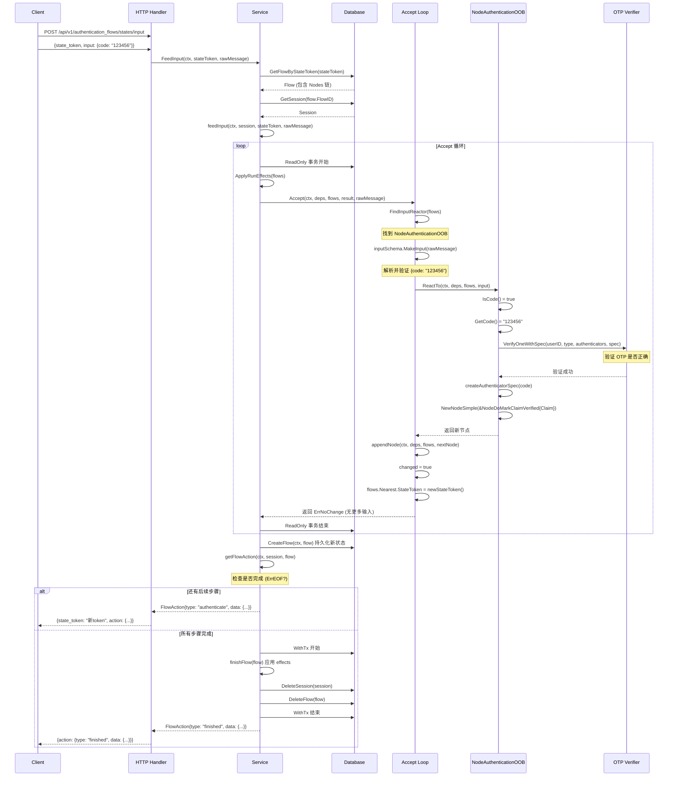
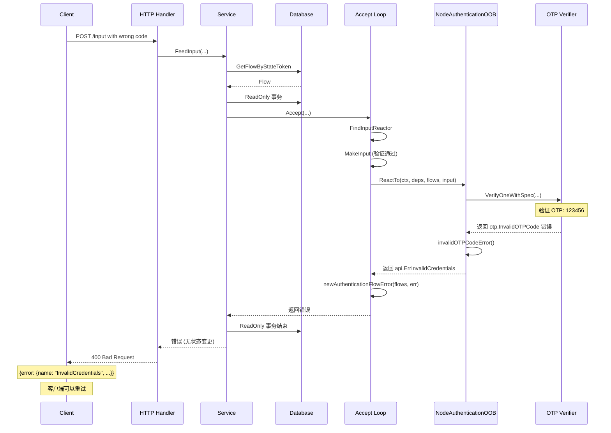
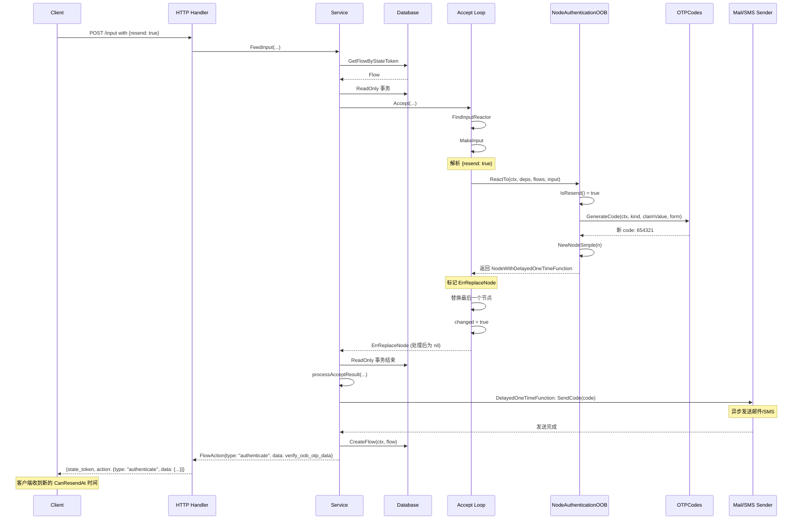
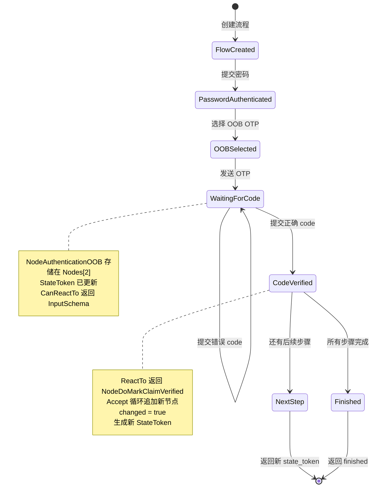

# OOB OTP Code 提交时序图

## Accept 循环设计说明

### 为什么需要循环？

Accept 循环是 Authgear Flow 的核心执行机制。单次请求处理单个 input 看似足够，但以下场景需要循环：

1. **自动推进（Nil Input）**：创建 Flow 时传入 nil input，系统自动推进到第一个需要用户输入的状态
2. **连锁反应**：一个 input 可能触发多个自动步骤（如 CREATE_IDENTITY → USER_PROFILE）
3. **SubFlow 展开**：创建 SubFlow 后需要立即处理其内部节点

### 为什么优先检查最后一个 Node？

```
Nodes 链: [A, B, C, D]
                    ^
                    最新 Node，代表当前活跃状态
```

- Node A/B/C 已完成（返回 ErrEOF）
- Node D 是当前活跃状态，优先检查
- 采用**栈式执行模型**，深层 SubFlow 优先

### 循环终止条件

- `ErrIncompatibleInput`：无法处理当前 input
- `ErrSameNode`：节点无限循环自我处理
- `ErrReplaceNode`：节点被替换
- 其他错误
- 无更多可处理的节点

---

## 1. 正常提交流程（验证成功）



## 2. 验证失败流程



## 3. 重发 OTP 流程



## 4. 状态流转图



## 5. 数据存储结构

```
┌─────────────────────────────────────────────────────────────┐
│                        Flow 表                               │
├─────────────────────────────────────────────────────────────┤
│ flow_id:       "flow_abc123"                                 │
│ state_token:   "authflowstate_2IrRI8IB3ud..."                │
│ intent:        IntentLoginFlow                               │
│                                                                 │
│ nodes: [                                                      │
│   {                                                          │
│     type: "NodeSimple",                                       │
│     simple: {                                                │
│       kind: "NodeDoUseAuthenticatorPassword",               │
│       user_id: "user_123"                                    │
│     }                                                        │
│   },                                                         │
│   {                                                          │
│     type: "NodeSimple",                                       │
│     simple: {                                                │
│       kind: "NodeDidSelectAuthenticator",                  │
│       authenticator_id: "authn_oob_email_xxx"               │
│     }                                                        │
│   },                                                         │
│   {                                                          │
│     type: "NodeSimple",                                       │
│     simple: {                                                │
│       kind: "NodeAuthenticationOOB",                       │
│       user_id: "user_123",                                   │
│       channel: "email",                                      │
│       info: {                                                │
│         oob_otp: {                                           │
│           email: "user@example.com"                          │
│         }                                                    │
│       },                                                     │
│       websocket_channel_name: "ws_xxx"                     │
│     }                                                        │
│   }                                                          │
│ ]                                                            │
└─────────────────────────────────────────────────────────────┘

┌─────────────────────────────────────────────────────────────┐
│                      Session 表                              │
├─────────────────────────────────────────────────────────────┤
│ flow_id:       "flow_abc123"                                │
│ user_id:       "user_123" (可选，登录后设置)                   │
│ redirect_uri:  "https://app.example.com/callback"           │
│ ...                                                          │
└─────────────────────────────────────────────────────────────┘
```

## 6. Input Schema 验证流程

```
rawMessage (JSON)
    ↓
InputSchemaNodeAuthenticationOOB.MakeInput()
    ↓
SchemaBuilder().ToSimpleSchema().Validator().ParseJSONRawMessage()
    ↓
JSON Schema 验证 (oneOf)
    ├─ {"resend": true}           → IsResend() = true
    ├─ {"code": "string"}          → IsCode() = true
    └─ {"check": true}            → IsCheck() = true (仅 link 形式)
    ↓
InputNodeAuthenticationOOB
    ↓
ReactTo(ctx, deps, flows, input)
```

## 7. OTP 验证内部调用链

```
NodeAuthenticationOOB.ReactTo()
    ↓
VerifyOneWithSpec(
    userID: "user_123",
    authenticatorType: "oob_otp_email",
    authenticators: [...],
    spec: {
        oob_otp: {
            code: "123456",
            email: "user@example.com"
        }
    },
    options: {
        authentication_details: {...},
        form: "code"
    }
)
    ↓
OTPCodeService.VerifyCode() / TOTP.Verify()
    ↓
返回: (authenticator.Info, true, nil) 或错误
```
