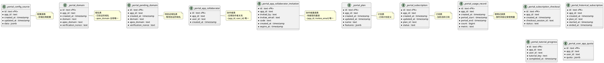

# 数据库模型 - Portal

```plantuml
@startuml Portal模型
skinparam linetype ortho
skinparam roundcorner 10

entity "_portal_config_source" as ConfigSource {
  * id : text <<PK>>
  * app_id : text
  * created_at : timestamp
  * updated_at : timestamp
  * data : jsonb
}

entity "_portal_domain" as Domain {
  * id : text <<PK>>
  * app_id : text
  * created_at : timestamp
  * domain : text
  * apex_domain : text
  * verification_nonce : text
}

entity "_portal_pending_domain" as PendingDomain {
  * id : text <<PK>>
  * app_id : text
  * created_at : timestamp
  * domain : text
  * apex_domain : text
  * verification_nonce : text
}

entity "_portal_app_collaborator" as Collaborator {
  * id : text <<PK>>
  * app_id : text
  * user_id : text
  * created_at : timestamp
}

entity "_portal_app_collaborator_invitation" as CollaboratorInvitation {
  * id : text <<PK>>
  * app_id : text
  * invited_by : text
  * invitee_email : text
  * code : text
  * created_at : timestamp
  * expire_at : timestamp
}

entity "_portal_plan" as Plan {
  * id : text <<PK>>
  * app_id : text
  * created_at : timestamp
  * updated_at : timestamp
  * name : text
  * features : jsonb
}

entity "_portal_subscription" as Subscription {
  * id : text <<PK>>
  * app_id : text
  * created_at : timestamp
  * updated_at : timestamp
  * plan_id : text
  * status : text
}

entity "_portal_subscription_checkout" as SubscriptionCheckout {
  * id : text <<PK>>
  * app_id : text
  * created_at : timestamp
  * checkout_session_id : text
  * status : text
}

entity "_portal_historical_subscription" as HistoricalSubscription {
  * id : text <<PK>>
  * app_id : text
  * created_at : timestamp
  * plan_id : text
  * started_at : timestamp
  * ended_at : timestamp
}

entity "_portal_usage_record" as UsageRecord {
  * id : text <<PK>>
  * app_id : text
  * created_at : timestamp
  * period_start : timestamp
  * period_end : timestamp
  * count : bigint
  * metric : text
}

entity "_portal_tutorial_progress" as TutorialProgress {
  * id : text <<PK>>
  * app_id : text
  * user_id : text
  * tutorial_key : text
  * completed_at : timestamp
}

entity "_portal_user_app_quota" as UserAppQuota {
  * id : text <<PK>>
  * app_id : text
  * user_id : text
  * quota : jsonb
}

note right of ConfigSource
  配置源表
  - 存储应用配置
end note

note right of Domain
  域名表
  - 已验证的域名
  - apex_domain 全局唯一
end note

note right of PendingDomain
  待验证域名表
  - 等待验证的域名
end note

note right of Collaborator
  协作者表
  - 应用协作者关系
  - (app_id, user_id) 唯一
end note

note right of CollaboratorInvitation
  协作者邀请表
  - 待接受的邀请
  - (app_id, invitee_email) 唯一
end note

note right of Plan
  计划表
  - 订阅计划定义
end note

note right of Subscription
  订阅表
  - 当前活跃订阅
end note

note right of UsageRecord
  使用记录表
  - 按时间段记录使用量
end note

@enduml
```
