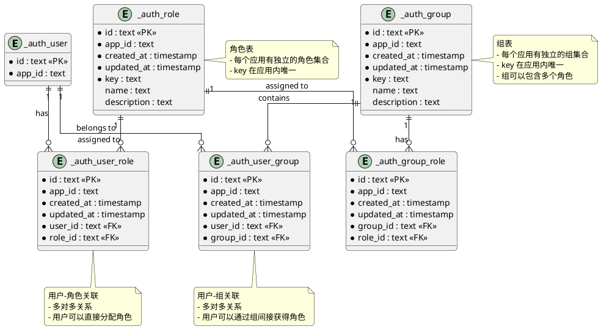

# 数据库模型 - RBAC

```plantuml
@startuml RBAC模型
skinparam linetype ortho
skinparam roundcorner 10

entity "_auth_user" as User {
  * id : text <<PK>>
  * app_id : text
}

entity "_auth_role" as Role {
  * id : text <<PK>>
  * app_id : text
  * created_at : timestamp
  * updated_at : timestamp
  * key : text
  name : text
  description : text
}

entity "_auth_group" as Group {
  * id : text <<PK>>
  * app_id : text
  * created_at : timestamp
  * updated_at : timestamp
  * key : text
  name : text
  description : text
}

entity "_auth_user_role" as UserRole {
  * id : text <<PK>>
  * app_id : text
  * created_at : timestamp
  * updated_at : timestamp
  * user_id : text <<FK>>
  * role_id : text <<FK>>
}

entity "_auth_user_group" as UserGroup {
  * id : text <<PK>>
  * app_id : text
  * created_at : timestamp
  * updated_at : timestamp
  * user_id : text <<FK>>
  * group_id : text <<FK>>
}

entity "_auth_group_role" as GroupRole {
  * id : text <<PK>>
  * app_id : text
  * created_at : timestamp
  * updated_at : timestamp
  * group_id : text <<FK>>
  * role_id : text <<FK>>
}

User "1" ||--o{ UserRole : has
Role "1" ||--o{ UserRole : assigned to
User "1" ||--o{ UserGroup : belongs to
Group "1" ||--o{ UserGroup : contains
Group "1" ||--o{ GroupRole : has
Role "1" ||--o{ GroupRole : assigned to

note right of Role
  角色表
  - 每个应用有独立的角色集合
  - key 在应用内唯一
end note

note right of Group
  组表
  - 每个应用有独立的组集合
  - key 在应用内唯一
  - 组可以包含多个角色
end note

note bottom of UserRole
  用户-角色关联
  - 多对多关系
  - 用户可以直接分配角色
end note

note bottom of UserGroup
  用户-组关联
  - 多对多关系
  - 用户可以通过组间接获得角色
end note

@enduml
```
