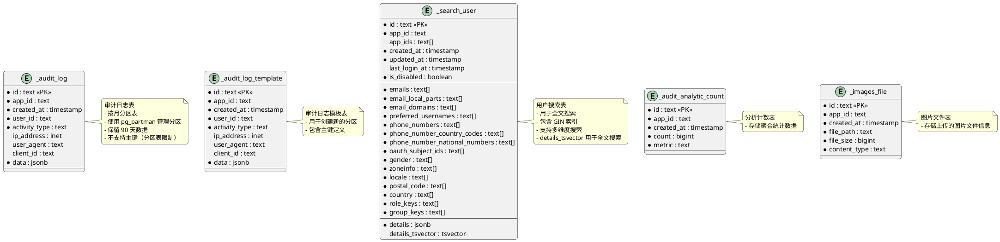

# 数据库模型 - 审计和搜索

```plantuml
@startuml 审计和搜索模型
skinparam linetype ortho
skinparam roundcorner 10

entity "_audit_log" as AuditLog {
  * id : text <<PK>>
  * app_id : text
  * created_at : timestamp
  * user_id : text
  * activity_type : text
  ip_address : inet
  user_agent : text
  client_id : text
  * data : jsonb
}

entity "_audit_log_template" as AuditLogTemplate {
  * id : text <<PK>>
  * app_id : text
  * created_at : timestamp
  * user_id : text
  * activity_type : text
  ip_address : inet
  user_agent : text
  client_id : text
  * data : jsonb
}

entity "_audit_analytic_count" as AnalyticCount {
  * id : text <<PK>>
  * app_id : text
  * created_at : timestamp
  * count : bigint
  * metric : text
}

entity "_search_user" as SearchUser {
  * id : text <<PK>>
  * app_id : text
  app_ids : text[]
  * created_at : timestamp
  * updated_at : timestamp
  last_login_at : timestamp
  * is_disabled : boolean
  --
  * emails : text[]
  * email_local_parts : text[]
  * email_domains : text[]
  * preferred_usernames : text[]
  * phone_numbers : text[]
  * phone_number_country_codes : text[]
  * phone_number_national_numbers : text[]
  * oauth_subject_ids : text[]
  * gender : text[]
  * zoneinfo : text[]
  * locale : text[]
  * postal_code : text[]
  * country : text[]
  * role_keys : text[]
  * group_keys : text[]
  --
  * details : jsonb
  details_tsvector : tsvector
}

entity "_images_file" as ImagesFile {
  * id : text <<PK>>
  * app_id : text
  * created_at : timestamp
  * file_path : text
  * file_size : bigint
  * content_type : text
}

note right of AuditLog
  审计日志表
  - 按月分区表
  - 使用 pg_partman 管理分区
  - 保留 90 天数据
  - 不支持主键（分区表限制）
end note

note right of AuditLogTemplate
  审计日志模板表
  - 用于创建新的分区
  - 包含主键定义
end note

note right of SearchUser
  用户搜索表
  - 用于全文搜索
  - 包含 GIN 索引
  - 支持多维度搜索
  - details_tsvector 用于全文搜索
end note

note right of AnalyticCount
  分析计数表
  - 存储聚合统计数据
end note

note right of ImagesFile
  图片文件表
  - 存储上传的图片文件信息
end note

@enduml
```
