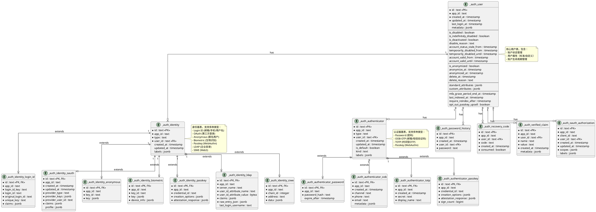

# 数据库模型 - 核心认证

```plantuml
@startuml 核心认证模型
skinparam linetype ortho
skinparam roundcorner 10

entity "_auth_user" as User {
  * id : text <<PK>>
  * app_id : text
  * created_at : timestamp
  * updated_at : timestamp
  last_login_at : timestamp
  metadata : jsonb
  --
  is_disabled : boolean
  is_indefinitely_disabled : boolean
  is_deactivated : boolean
  disable_reason : text
  account_status_stale_from : timestamp
  temporarily_disabled_from : timestamp
  temporarily_disabled_until : timestamp
  account_valid_from : timestamp
  account_valid_until : timestamp
  --
  is_anonymized : boolean
  anonymize_at : timestamp
  anonymized_at : timestamp
  delete_at : timestamp
  delete_reason : text
  --
  standard_attributes : jsonb
  custom_attributes : jsonb
  --
  mfa_grace_period_end_at : timestamp
  last_indexed_at : timestamp
  require_reindex_after : timestamp
  opt_out_passkey_upsell : boolean
}

entity "_auth_identity" as Identity {
  * id : text <<PK>>
  * app_id : text
  * type : text
  * user_id : text <<FK>>
  created_at : timestamp
  updated_at : timestamp
  labels : jsonb
}

entity "_auth_identity_login_id" as IdentityLoginID {
  * id : text <<PK, FK>>
  * app_id : text
  * login_id_key : text
  * login_id : text
  * original_login_id : text
  * unique_key : text
  * claims : jsonb
}

entity "_auth_identity_oauth" as IdentityOAuth {
  * id : text <<PK, FK>>
  * app_id : text
  * created_at : timestamp
  * updated_at : timestamp
  * provider_type : text
  * provider_keys : jsonb
  * provider_user_id : text
  * claims : jsonb
  profile : jsonb
}

entity "_auth_identity_anonymous" as IdentityAnonymous {
  * id : text <<PK, FK>>
  * app_id : text
  * key_id : text
  * key : jsonb
}

entity "_auth_identity_biometric" as IdentityBiometric {
  * id : text <<PK, FK>>
  * app_id : text
  * key_id : text
  * key : jsonb
  * device_info : jsonb
}

entity "_auth_identity_passkey" as IdentityPasskey {
  * id : text <<PK, FK>>
  * app_id : text
  * credential_id : text
  * creation_options : jsonb
  * attestation_response : jsonb
}

entity "_auth_identity_ldap" as IdentityLDAP {
  * id : text <<PK, FK>>
  * app_id : text
  * server_name : text
  * user_id_attribute_name : text
  * user_id_attribute_value : bytea
  * claims : jsonb
  * raw_entry_json : jsonb
  last_login_username : text
}

entity "_auth_identity_siwe" as IdentitySIWE {
  * id : text <<PK, FK>>
  * app_id : text
  * chain_id : integer
  * address : text
  * data : jsonb
}

entity "_auth_authenticator" as Authenticator {
  * id : text <<PK>>
  * app_id : text
  * type : text
  * user_id : text <<FK>>
  created_at : timestamp
  updated_at : timestamp
  is_default : boolean
  kind : text
  labels : jsonb
}

entity "_auth_authenticator_password" as AuthenticatorPassword {
  * id : text <<PK, FK>>
  * app_id : text
  * password_hash : text
  expire_after : timestamp
}

entity "_auth_authenticator_oob" as AuthenticatorOOB {
  * id : text <<PK, FK>>
  * app_id : text
  * created_at : timestamp
  * channel : text
  * phone : text
  * email : text
  metadata : jsonb
}

entity "_auth_authenticator_totp" as AuthenticatorTOTP {
  * id : text <<PK, FK>>
  * app_id : text
  * created_at : timestamp
  * secret : text
  * display_name : text
}

entity "_auth_authenticator_passkey" as AuthenticatorPasskey {
  * id : text <<PK, FK>>
  * app_id : text
  * credential_id : text
  * creation_options : jsonb
  * attestation_response : jsonb
  * sign_count : bigint
}

entity "_auth_password_history" as PasswordHistory {
  * id : text <<PK>>
  * app_id : text
  * created_at : timestamp
  * user_id : text <<FK>>
  * password : text
}

entity "_auth_recovery_code" as RecoveryCode {
  * id : text <<PK>>
  * app_id : text
  * user_id : text <<FK>>
  * code : text
  * created_at : timestamp
  * consumed : boolean
}

entity "_auth_verified_claim" as VerifiedClaim {
  * id : text <<PK>>
  * app_id : text
  * user_id : text <<FK>>
  * name : text
  * value : text
  * created_at : timestamp
  metadata : jsonb
}

entity "_auth_oauth_authorization" as OAuthAuthorization {
  * id : text <<PK>>
  * app_id : text
  * client_id : text
  * user_id : text <<FK>>
  * created_at : timestamp
  * updated_at : timestamp
  * scopes : jsonb
  labels : jsonb
}

User "1" ||--o{ Identity : has
User "1" ||--o{ Authenticator : has
User "1" ||--o{ PasswordHistory : has
User "1" ||--o{ RecoveryCode : has
User "1" ||--o{ VerifiedClaim : has
User "1" ||--o{ OAuthAuthorization : has

Identity "1" ||--o| IdentityLoginID : extends
Identity "1" ||--o| IdentityOAuth : extends
Identity "1" ||--o| IdentityAnonymous : extends
Identity "1" ||--o| IdentityBiometric : extends
Identity "1" ||--o| IdentityPasskey : extends
Identity "1" ||--o| IdentityLDAP : extends
Identity "1" ||--o| IdentitySIWE : extends

Authenticator "1" ||--o| AuthenticatorPassword : extends
Authenticator "1" ||--o| AuthenticatorOOB : extends
Authenticator "1" ||--o| AuthenticatorTOTP : extends
Authenticator "1" ||--o| AuthenticatorPasskey : extends

note right of User
  核心用户表，包含：
  - 账户状态管理
  - 用户属性（标准/自定义）
  - 账户生命周期管理
end note

note right of Identity
  身份基表，支持多种类型：
  - Login ID (邮箱/手机/用户名)
  - OAuth (第三方登录)
  - Anonymous (匿名用户)
  - Biometric (生物识别)
  - Passkey (WebAuthn)
  - LDAP (企业目录)
  - SIWE (Web3)
end note

note right of Authenticator
  认证器基表，支持多种类型：
  - Password (密码)
  - OOB-OTP (邮箱/短信验证码)
  - TOTP (时间型OTP)
  - Passkey (WebAuthn)
end note

@enduml
```
