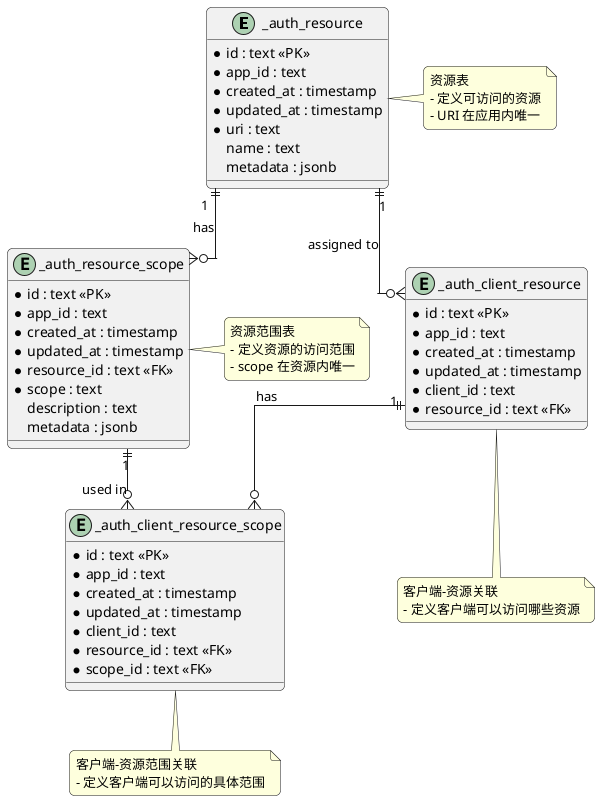

# 数据库模型 - 资源范围

```plantuml
@startuml 资源范围模型
skinparam linetype ortho
skinparam roundcorner 10

entity "_auth_resource" as Resource {
  * id : text <<PK>>
  * app_id : text
  * created_at : timestamp
  * updated_at : timestamp
  * uri : text
  name : text
  metadata : jsonb
}

entity "_auth_resource_scope" as ResourceScope {
  * id : text <<PK>>
  * app_id : text
  * created_at : timestamp
  * updated_at : timestamp
  * resource_id : text <<FK>>
  * scope : text
  description : text
  metadata : jsonb
}

entity "_auth_client_resource" as ClientResource {
  * id : text <<PK>>
  * app_id : text
  * created_at : timestamp
  * updated_at : timestamp
  * client_id : text
  * resource_id : text <<FK>>
}

entity "_auth_client_resource_scope" as ClientResourceScope {
  * id : text <<PK>>
  * app_id : text
  * created_at : timestamp
  * updated_at : timestamp
  * client_id : text
  * resource_id : text <<FK>>
  * scope_id : text <<FK>>
}

Resource "1" ||--o{ ResourceScope : has
Resource "1" ||--o{ ClientResource : assigned to
ResourceScope "1" ||--o{ ClientResourceScope : used in
ClientResource "1" ||--o{ ClientResourceScope : has

note right of Resource
  资源表
  - 定义可访问的资源
  - URI 在应用内唯一
end note

note right of ResourceScope
  资源范围表
  - 定义资源的访问范围
  - scope 在资源内唯一
end note

note bottom of ClientResource
  客户端-资源关联
  - 定义客户端可以访问哪些资源
end note

note bottom of ClientResourceScope
  客户端-资源范围关联
  - 定义客户端可以访问的具体范围
end note

@enduml
```
