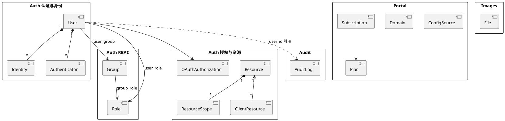

# Authgear Schema → DDD 模型总览

基于 `.local/database/authgear_schema.sql`，按有界上下文划分。

## 有界上下文与表映射

| 有界上下文      | 聚合根                         | 核心表前缀                                                                                   | 说明             |
| ---------- | --------------------------- | --------------------------------------------------------------------------------------- | -------------- |
| Auth 认证与身份 | User                        | _auth_user, _auth_identity*, _auth_authenticator*                                       | 用户、身份、认证器      |
| Auth RBAC  | Role / Group                | _auth_role, _auth_group, _auth_user_role, _auth_user_group, _auth_group_role            | 角色与组           |
| Auth 授权与资源 | Authorization / Resource    | _auth_oauth_authorization, _auth_resource, _auth_resource_scope, _auth_client_resource* | OAuth 授权、资源与范围 |
| Audit 审计   | AuditLog                    | _audit_log, _audit_analytic_count                                                       | 审计日志与统计        |
| Portal 门户  | App / Subscription / Domain | _portal_*                                                                               | 应用配置、订阅、域名、协作  |
| Images 资源  | File                        | _images_file                                                                            | 图片/文件存储        |

**多租户**: 所有业务表以 `app_id` 为租户键（除 _portal_plan, _portal_user_app_quota 等全局表）。

## 有界上下文与聚合关系

---

## 聚合边界（按表）

- **User 聚合**: _auth_user（根）, _auth_identity, _auth_identity_*, _auth_authenticator, _auth_authenticator_*, _auth_verified_claim, _auth_password_history, _auth_recovery_code  
  通过 user_id 引用；Identity/Authenticator 为实体，其余为值对象或从属实体。
- **Role 聚合**: _auth_role（根）, _auth_user_role, _auth_group_role  
- **Group 聚合**: _auth_group（根）, _auth_user_group, _auth_group_role  
- **Resource 聚合**: _auth_resource（根）, _auth_resource_scope  
- **Client-Resource 聚合**: _auth_client_resource（根）, _auth_client_resource_scope  
- **OAuth 授权聚合**: _auth_oauth_authorization（根），client_id + user_id + scopes  
- **Audit 聚合**: _audit_log（根，按时间分区）, _audit_analytic_count  
- **Portal 聚合**: 见 03-Portal领域.md  

详见各领域文档。
