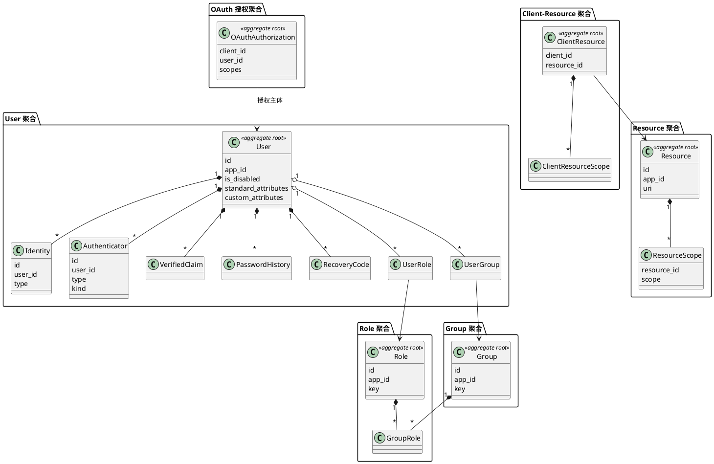

# Auth 领域（DDD）

## 聚合关系图

## 1. User 聚合

**聚合根**: User  
**表**: _auth_user

| 表 | 角色 | 与根关系 |
|----|------|----------|
| _auth_user | 聚合根 | id |
| _auth_identity | 实体 | user_id, type 区分具体表 |
| _auth_identity_login_id / oauth / passkey / anonymous / biometric / ldap / siwe | 实体（继承/子表） | id = identity.id |
| _auth_authenticator | 实体 | user_id, type + kind |
| _auth_authenticator_password / totp / oob / passkey | 实体（子表） | id = authenticator.id |
| _auth_verified_claim | 值对象/实体 | user_id |
| _auth_password_history | 从属 | user_id |
| _auth_recovery_code | 从属 | user_id |
| _auth_user_role | 关联实体 | user_id → Role |
| _auth_user_group | 关联实体 | user_id → Group |

**不变式**: 同一 app_id 下用户唯一；身份/认证器归属用户；删除/禁用通过 user 状态字段表达。

**Identity 类型**: login_id, oauth, passkey, anonymous, biometric, ldap, siwe（与 _auth_identity_* 一一对应）。

---

## 2. Role 聚合

**聚合根**: Role  
**表**: _auth_role（key 唯一）, _auth_user_role, _auth_group_role  

**不变式**: role 由 app 内 key 唯一标识；用户/组通过关联表挂到角色。

---

## 3. Group 聚合

**聚合根**: Group  
**表**: _auth_group（key 唯一）, _auth_user_group, _auth_group_role  

**不变式**: group 由 app 内 key 唯一；组可绑定角色，用户可挂到组。

---

## 4. Resource 聚合

**聚合根**: Resource  
**表**: _auth_resource（uri 等）, _auth_resource_scope  

**不变式**: 资源下 scope 唯一；供 OAuth 资源范围使用。

---

## 5. Client-Resource 聚合（OAuth 客户端授权资源）

**聚合根**: ClientResource（逻辑）  
**表**: _auth_client_resource（client_id + resource_id）, _auth_client_resource_scope  

**不变式**: 同一 client 对同一 resource 一条记录；scope 在 client_resource_scope。

---

## 6. OAuth 授权聚合

**聚合根**: OAuthAuthorization  
**表**: _auth_oauth_authorization（client_id, user_id, scopes）  

**不变式**: 每 client + user 一条授权记录；scopes 为 jsonb。

---

## 跨聚合引用

- User ← Identity, Authenticator, UserRole, UserGroup, VerifiedClaim, PasswordHistory, RecoveryCode  
- Role ← UserRole, GroupRole  
- Group ← UserGroup, GroupRole  
- Resource ← ResourceScope, ClientResource  
- ClientResource ← ClientResourceScope  

**仓储建议**: UserRepository, IdentityRepository, AuthenticatorRepository, RoleRepository, GroupRepository, ResourceRepository, ClientResourceRepository, OAuthAuthorizationRepository；按聚合加载，避免跨聚合写在同一事务（除明确用例）。
