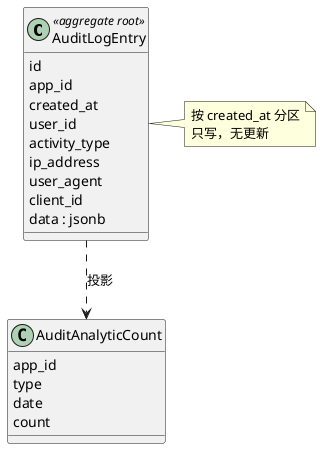

# Audit 领域（DDD）

## 关系图

## 聚合

**聚合根**: AuditLogEntry（单条日志）  
**表**: _audit_log（主表，按 created_at 分区）, _audit_log_* 分区子表  

**字段**: id, app_id, created_at, user_id, activity_type, ip_address, user_agent, client_id, data(jsonb)

**设计**: 审计日志为追加型；无业务不变式修改，仅插入。可视为**事件流**或**只写聚合**。

---

## 统计子域

**表**: _audit_analytic_count（app_id, type, date 唯一）  
**用途**: 按类型、日期的计数汇总，可视为读模型/投影。

---

## 基础设施

**表**: _audit_migration  
**领域服务**: 日志写入服务、通知（若需）；查询走 CQRS 读侧即可。
