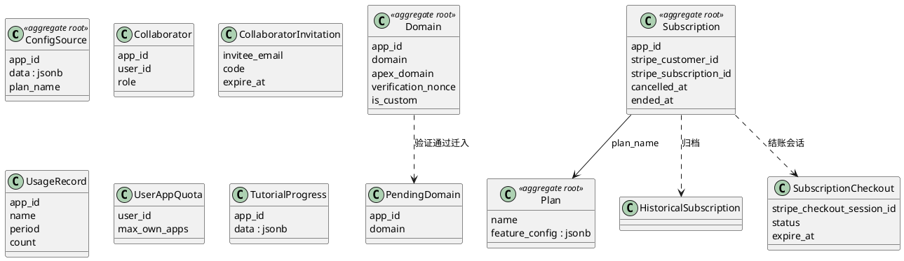

# Portal 领域（DDD）

## 关系图

## 1. 应用配置聚合

**聚合根**: ConfigSource  
**表**: _portal_config_source（app_id, data jsonb, plan_name）  

**不变式**: 每 app 一条配置源；变更触发 notify_config_source_change。

---

## 2. 域名聚合

**聚合根**: Domain  
**表**: _portal_domain（app_id, domain, apex_domain, verification_nonce, is_custom）  
**待验证**: _portal_pending_domain  

**不变式**: 域名验证通过后从 pending 迁入 domain；变更触发 notify_domain_change。

---

## 3. 订阅与计费聚合

**聚合根**: Subscription  
**表**: _portal_subscription（app_id, stripe_customer_id, stripe_subscription_id, cancelled_at, ended_at）  
**历史**: _portal_historical_subscription  
**结账**: _portal_subscription_checkout（stripe_checkout_session_id, status, expire_at）  

**不变式**: 一个 app 对应当前一条有效订阅；历史归档到 historical。

---

## 4. 计划聚合（全局）

**聚合根**: Plan  
**表**: _portal_plan（name 唯一, feature_config jsonb）  

**不变式**: 计划名全局唯一；变更触发 notify_plan_change。

---

## 5. 协作聚合

**表**: _portal_app_collaborator（app_id, user_id, role）, _portal_app_collaborator_invitation（invitee_email, code, expire_at）  

**聚合根**: 可按 App 为根，Collaborator / Invitation 为实体。

---

## 6. 用量与配额

**表**: _portal_usage_record（app_id, name, period, start_time, end_time, count）  
**表**: _portal_user_app_quota（user_id, max_own_apps）  

**用途**: 用量记录为事实；配额为全局用户维度，可作值对象或单独小聚合。

---

## 7. 教程进度

**表**: _portal_tutorial_progress（app_id 为主键, data jsonb）  
**角色**: 按 app 的轻量聚合或值对象。
