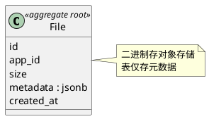

# Images 领域（DDD）

## 关系图

## 聚合

**聚合根**: File  
**表**: _images_file（id, app_id, size, metadata jsonb, created_at）  

**不变式**: 文件按 id 唯一；仅存储元数据，二进制另存（如对象存储）。

**基础设施**: _images_migrations

**领域服务**: 上传、下载、删除；仓储按 app_id + id 加载。
